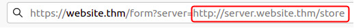
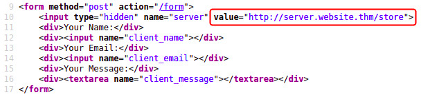
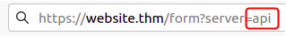
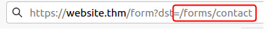

2025-07-16 17:54

Status:

Tags: [[THM Web Fundementals]] [[tryhackme]]
###### Prerequisites: 
# Finding SSRF
Potential SSRF vulnerabilities can be spotted in web applications in many different ways. Here is an example of four common places to look:

**When a full URL is used in a parameter in the address bar:**

  

**A hidden field in a form:**

  

**A partial URL such as just the hostname:**

  

**Or perhaps only the path of the URL:**

Some of these examples are easier to exploit than others, and this is where a lot of trial and error will be required to find a working payload.

If working with a blind SSRF where no output is reflected back to you, you'll need to use an external HTTP logging tool to monitor requests such as requestbin.com, your own HTTP server or Burp Suite's Collaborator client.