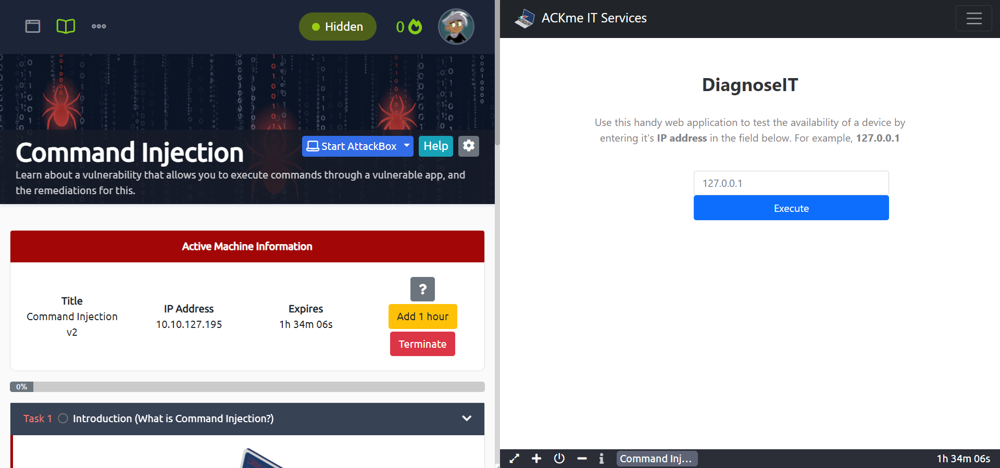

2025-07-20 05:23

Status:

Tags: [[tryhackme]]. [[THM Web Fundementals]] [[Tags/Command Injection|Command Injection]]
###### Prerequisites: 
# Practical Command Injection (Deploy)
Deploy the machine attached to this task; it will be visible in the split-screen view once it is ready.

Test some payloads on the application hosted on the website visible in split-screen view to test for command injection. Refer to [this cheat sheet](https://github.com/payloadbox/command-injection-payload-list) if you are stuck or wish to explore some more complex payloads.

Find the contents of the flag located in **/home/tryhackme/flag.txt**. You can use a variety of payloads to achieve this – I recommend trying multiple.

Answer the questions below

What user is this application running as?

Correct Answer

What are the contents of the flag located in /home/tryhackme/flag.txt?  

Correct Answer

# Solution

### so when you execute any command it will output nothing

![[Pics/Screenshot 2025-07-20 at 5.24.56 AM.png]]

### you need to write ip and concatinate the command

![[Pics/Screenshot 2025-07-20 at 5.25.43 AM.png]]

# As you can see we are www-data thats answer for first question

# second question is the same![[Pics/Screenshot 2025-07-20 at 5.26.38 AM.png]]

