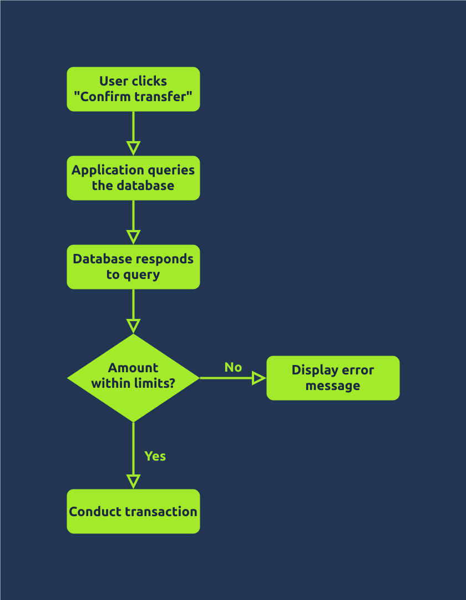
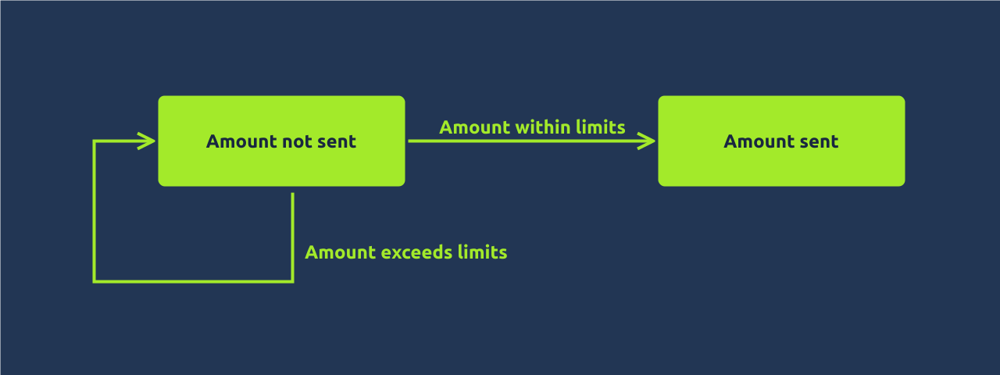
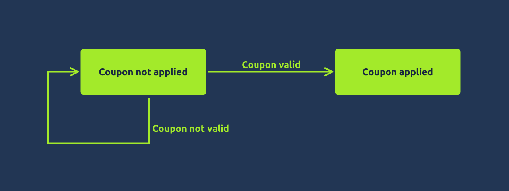
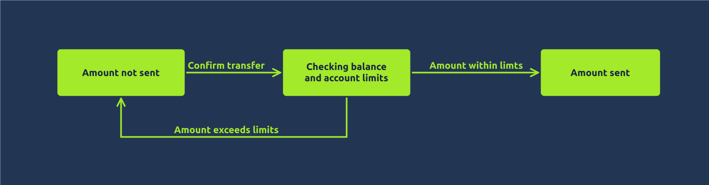

2025-07-19 00:20

Status:

Tags: [[THM Web Fundementals]] [[tryhackme]]
###### Prerequisites: 
# Race condition Web App Architicture
## Client-Server Model

Web applications follow a client-server model:

- **Client**: The client is the program or application that initiates the request for a service. For example, when we browse a web page, our web browser requests the web page (file) from a web server.
- **Server**: The server is the program or system that provides these services in response to incoming requests. For instance, the web server responds to an incoming HTTP `GET` request and sends an HTML page (or file) to the requesting web browser (client).

Generally speaking, the client-server model runs over a network. The client sends its request over the network, and the server receives it and processes it before sending back the required resource.

## Typical Web Application

A web application follows a multi-tier architecture. Such architecture separates the application logic into different layers or tiers. The most common design uses three tiers:

- **Presentation tier**: In web applications, this tier consists of the web browser on the client side. The web browser renders the HTML, CSS, and JavaScript code.
- **Application tier**: This tier contains the web application’s business logic and functionality. It receives client requests, processes them, and interacts with the data tier. It is implemented using server-side programming languages such as Node.js and PHP, among many others.
- **Data tier**: This tier is responsible for storing and manipulating the application data. Typical database operations include creating, updating, deleting, and searching existing records. It is usually achieved using a database management system (DBMS); examples of DBMS include MySQL and PostgreSQL.

## States

Let’s visit some examples from business logic before diving deeper. We will consider the following examples:

- Validating and conducting money transfer
- Validating coupon codes and applying discounts

### Validating and Conducting Money Transfer

Consider the example of transferring money to a friend or your other account. The program will progress as follows:

1. The user clicks on the “Confirm Transfer” button
2. The application queries the database to confirm that the account balance can cover the transfer amount
3. The database responds to the query
    1. If the amount is within the account limits, the application conducts the transaction
    2. If the amount is beyond the account limits, the application shows an error message

In an ideal scenario, the code above leads to two program states:

- Amount not sent
- Amount sent

### Validating coupon codes and applying discounts

Let’s consider the example of applying a discount coupon. The user goes to their shopping cart and adds a coupon to get a discount. The steps might be something along the following lines:

1. The user enters a coupon code
2. The application queries the database to determine whether the coupon code is valid and whether any constraints exist
3. The database responds with validity and constraints
    1. The discount is applied if the code is valid and there are no constraints on applying it for this user.
    2. An error message is displayed if the code is invalid or there are constraints on applying it for this user.

The above code leads to a few program states:

- Coupon not applied
- Coupon applied

## Two States? Think Again

Let’s continue our analysis of applying a discount coupon. Ideally, we expect two states: **Coupon not applied** and **Coupon applied**. However, this is too simplistic to depict real sophisticated scenarios. We can add an intermediary state: **Checking coupon applicability**.

Depending on how the application is developed, we can expect more states. For example, **Checking coupon applicability** might involve two states: **Checking coupon validity** and **Checking coupon constraints**. A coupon might be valid, but existing constraints prevent it from being applied. Similarly, **Coupon applied** might be divided into two states, one of which is **Recalculating total**.

**Why is this important for race conditions?**

In the state diagram above, we can see that we pass through multiple states before the coupon is marked as applied. Let’s draw the states on a time axis, as shown below.

There is a time window between the instant we try to add a coupon and the instant where the coupon is marked as applied and cannot be applied again. As long as the coupon is not marked as applied, most likely, no controls prevent it from being accepted repeatedly. We might be able to apply it multiple times during this time window.

This situation is similar when considering the states for the program making a money transfer. Although ideally speaking, it would be two states, considering the business logic, we can easily update the diagram to include three states. The reason is that we expect some time spent checking the account balance and limits; although this amount of time might be brief, it is not zero. If we dig deeper, we can uncover more “hidden” states.

However, even if the web application is vulnerable, we still have one challenge to overcome: timing. Even in vulnerable applications, this “window of opportunity” is relatively short; therefore, exploiting it necessitates that our requests reach the server simultaneously. In practice, we aim to get our repeated requests to reach the server only milliseconds apart.

How can we get our duplicated requests to reach the server within this short window? We need a tool such as Burp Suite.