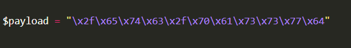

2025-07-20 05:19

Status:

Tags: [[tryhackme]] [[THM Web Fundementals]] [[Tags/Command Injection|Command Injection]]
###### Prerequisites: 
# Remediating Command Injection

Command injection can be prevented in a variety of ways. Everything from minimal use of potentially dangerous functions or libraries in a programming language to filtering input without relying on a user’s input. I have detailed these a bit further below. The examples below are of the PHP programming language; however, the same principles can be extended to many other languages.

  

**Vulnerable Functions**

In PHP, many functions interact with the operating system to execute commands via shell; these include:

- Exec
- Passthru
- System

  

Take this snippet below as an example. Here, the application will only accept and process numbers that are inputted into the form. This means that any commands such as `whoami` will not be processed.

1. The application will only accept a specific pattern of characters (the digits  0-9)
2. The application will then only proceed to execute this data which is all numerical.

  

These functions take input such as a string or user data and will execute whatever is provided on the system. Any application that uses these functions without proper checks will be vulnerable to command injection.

  

**Input sanitisation**

Sanitising any input from a user that an application uses is a great way to prevent command injection. This is a process of specifying the formats or types of data that a user can submit. For example, an input field that only accepts numerical data or removes any special characters such as `>` ,  `&` and `/`.

In the snippet below, the `filter_input` [PHP function](https://www.php.net/manual/en/function.filter-input.php) is used to check whether or not any data submitted via an input form is a number or not. If it is not a number, it must be invalid input.

  

Bypassing Filters

Applications will employ numerous techniques in filtering and sanitising data that is taken from a  user's input. These filters will restrict you to specific payloads; however, we can abuse the logic behind an application to bypass these filters. For example, an application may strip out quotation marks; we can instead use the hexadecimal value of this to achieve the same result.

When executed, although the data given will be in a different format than what is expected, it can still be interpreted and will have the same result.

