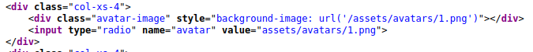
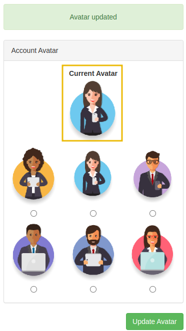
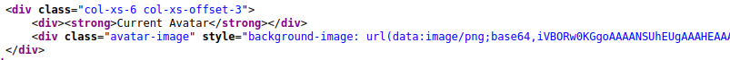
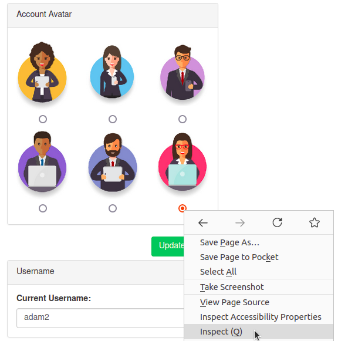
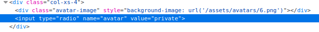
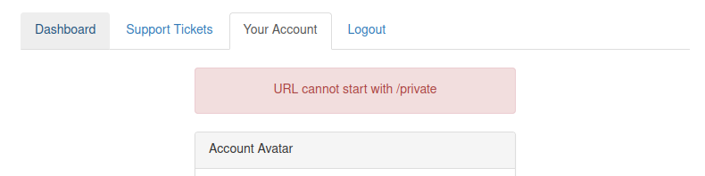
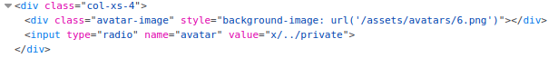

2025-07-16 18:10

Status:

Tags: [[THM Web Fundementals]] [[tryhackme]]
###### Prerequisites: 
# SSRF Practical Example

We've come across two new endpoints during a content discovery exercise against the **Acme IT Support** website. The first one is **/private**, which gives us an error message explaining that the contents cannot be viewed from our IP address. The second is a new version of the customer account page at **/customers/new-account-page** with a new feature allowing customers to choose an avatar for their account.

  

Begin by clicking the **Start Machine** button to launch the **Acme IT Support** website. Once running, visit it at the URL [https://LAB_WEB_URL.p.thmlabs.com](https://lab_web_url.p.thmlabs.com/) and then follow the below instructions to get the flag.

  

First, create a customer account and sign in. Once you've signed in, visit [https://LAB_WEB_URL.p.thmlabs.com/customers/new-account-page](https://lab_web_url.p.thmlabs.com/customers/new-account-page) to view the new avatar selection feature. By viewing the page source of the avatar form, you'll see the avatar form field value contains the path to the image. The background-image style can confirm this in the above DIV element as per the screenshot below:

  

  

If you choose one of the avatars and then click the **Update Avatar** button, you'll see the form change and, above it, display your currently selected avatar.

  

  

  

Viewing the page source will show your current avatar is displayed using the data URI scheme, and the image content is base64 encoded as per the screenshot below.  

  

  

  

Now let's try making the request again but changing the avatar value to **private** in hopes that the server will access the resource and get past the IP address block. To do this, firstly, right-click on one of the radio buttons on the avatar form and select **Inspect**:

  

  

  

**And then edit the value of the radio button to private:**

  

  

Be sure to select the avatar you edited and then click the **Update Avatar** button. Unfortunately, it looks like the web application has a deny list in place and has blocked access to the /private endpoint.

  

  

As you can see from the error message, the path cannot start with /private but don't worry, we've still got a trick up our sleeve to bypass this rule. We can use a directory traversal trick to reach our desired endpoint. Try setting the avatar value to **x/../private**

You'll see we have now bypassed the rule, and the user updated the avatar. This trick works because when the web server receives the request for **x/../private**, it knows that the **../** string means to move up a directory that now translates the request to just **/private**.

  

Viewing the page source of the avatar form, you'll see the currently set avatar now contains the contents from the **/private** directory in base64 encoding, decode this content and it will reveal a flag that you can enter below.