In this lab environment, you will have GUI access to a Kali machine. The ELK instance should be accessible at `http://elk.advanced.local:5601`. Use the `elk` index for all queries. Analyze the events generated in **June 2025**.

**Objective:** Perform threat hunting in ELK to complete the following tasks:

1. Can you identify any registry-based persistence via Winlogon involving PowerShell? If yes, which specific key was modified and what executable was configured to run?
    
2. A logon was attempted using explicit credentials. Can you identify any anomalies or suspicious behavior associated with this event?
    
3. Investigate a DLL Sideloading activity. What is the name and path of the DLL loaded? And is it malicious? (**Note:** Assume C:\Utilities\calc.exe to be a legitimate, signed executable)
    
4. Following unusual administrative activity, the system’s resistance to attacks may have been reduced. What security-relevant change was made?
    

**Logs to Check:** Security and Sysmon

# Tools

The best tools for this lab are:

- ELK
- Firefox
**Step 1:** Access the Kali machine.

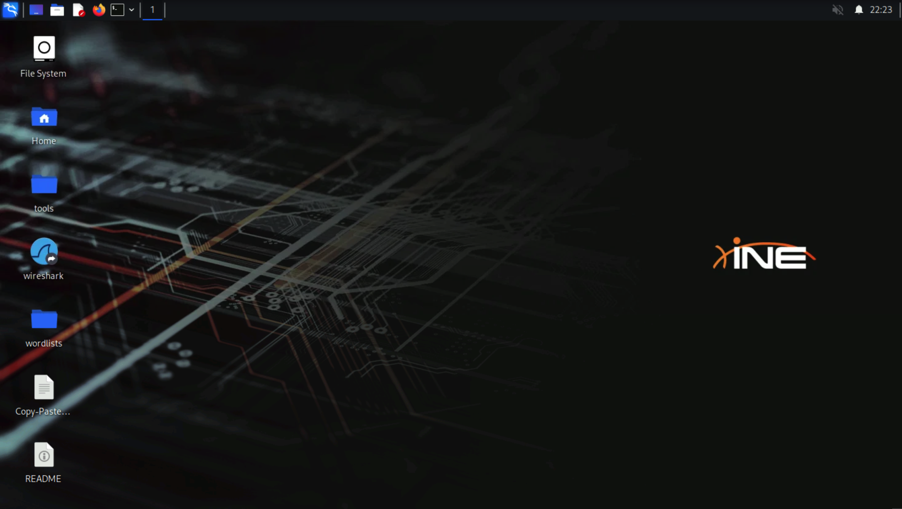

**Step 2:** Navigate to the following URL to access ELK:

**URL:**

```
http://elk.advanced.local:5601
```

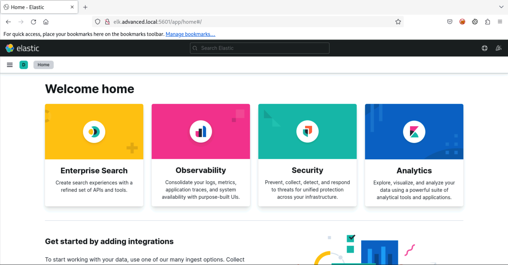

Go to **Discover**.

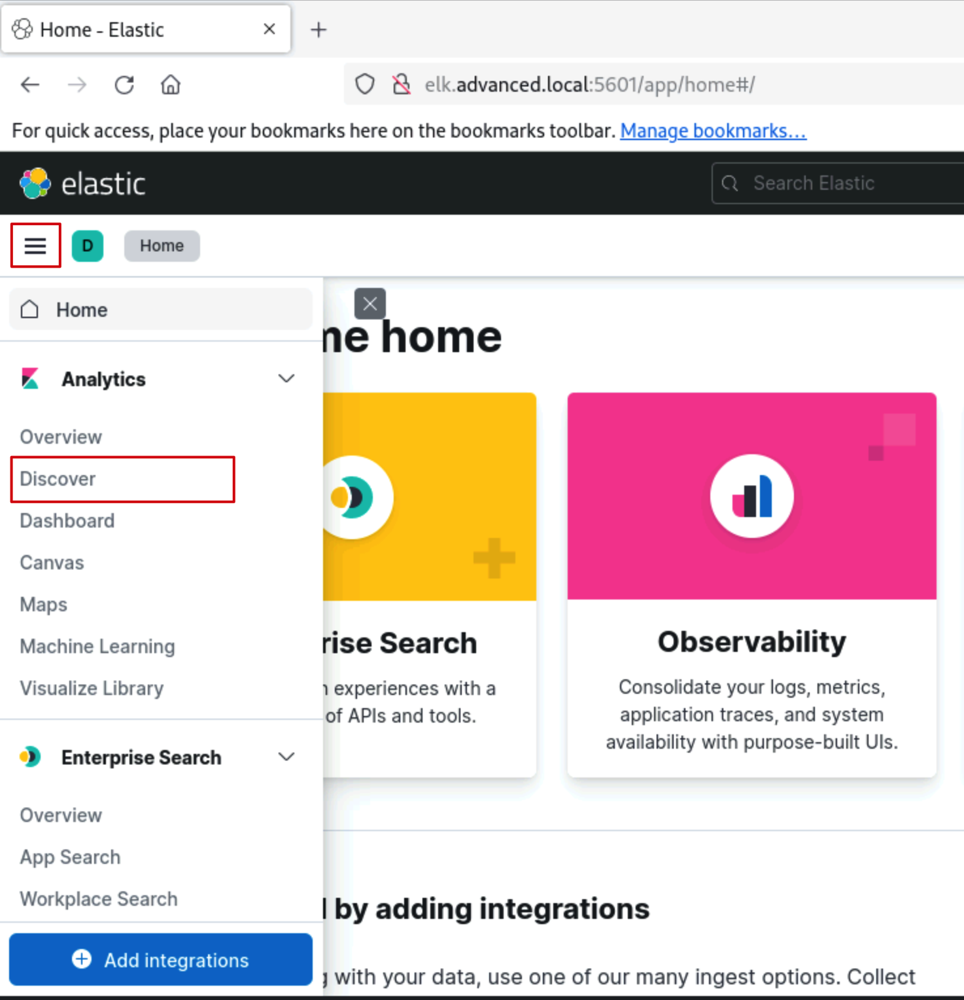

Set the time frame to "Last 1 year" or any other relevant range.

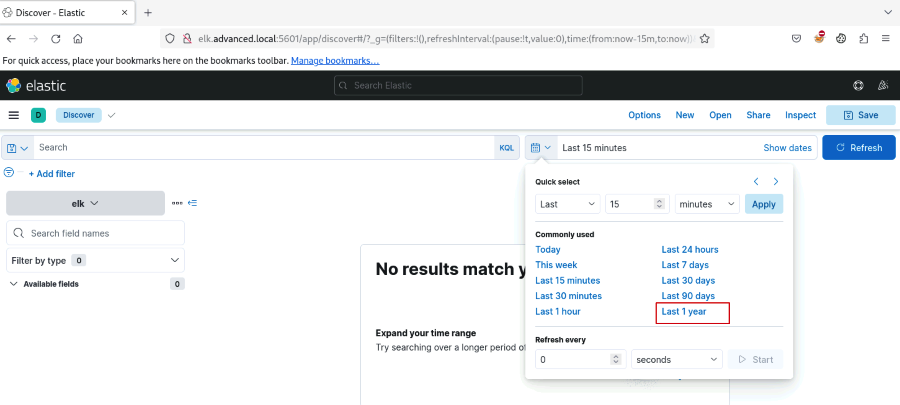

**Step 3:** Let's begin our investigation. Any registry-based persistence via Winlogon involving PowerShell can be identified using the following query:

**Query:**

```
winlog.channel:"Microsoft-Windows-Sysmon/Operational"
AND winlog.event_id:13
AND winlog.event_data.TargetObject.keyword:*\\Winlogon\\*
AND winlog.event_data.Image:*powershell.exe
```

**Explanation:**

`winlog.channel:"Microsoft-Windows-Sysmon/Operational"`:

- Filters logs from Sysmon.
    
- Ensures only events from the Sysmon/Operational channel are returned.
    

`winlog.event_id:13`:

- Filters for Sysmon Event ID 13, which logs registry value set operations.
    
- Triggered when a process modifies a registry key's value.
    

`winlog.event_data.TargetObject.keyword:*\\Winlogon\\*`:

- Narrows down results to registry modifications under the **Winlogon** key.
    
- **Winlogon** is a critical registry path used during user logon — often targeted for persistence by attackers.
    

`winlog.event_data.Image:*powershell.exe`:

- Filters events where the process responsible for the registry change is **powershell.exe**.
    
- Indicates that PowerShell (commonly abused in attacks) made the modification.
    

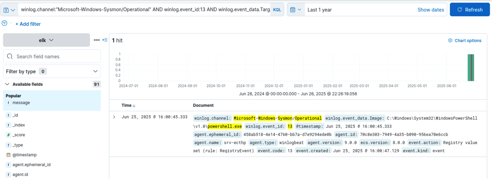

We have found an event. Expand it to see the details.

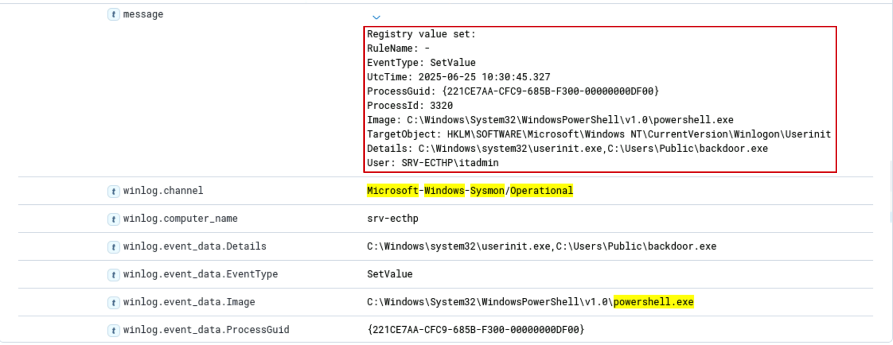

**Key Observations:**

- This event shows that `powershell.exe` modified the `Userinit` key registry value under the `Winlogon` key. The `Userinit` key specifies the program(s) to run automatically after a user logs in to Windows.
    
- The default path `userinit.exe` was appended with a suspicious executable (`backdoor.exe`), which suggests an attempt to establish persistence.
    
- The action was performed under the user `SRV-ECTHP\itadmin`, possibly indicating privilege misuse or compromise.
    

**Step 4:** To identify logon attempts made by explicitly specifying credentials, look for **Event ID 4648** in the **Security** logs.

**Query:**

```
winlog.channel:"Security" AND winlog.event_id:4648
```

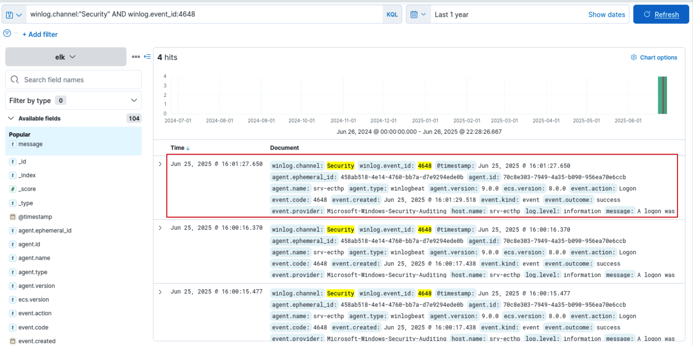

Check the latest event.

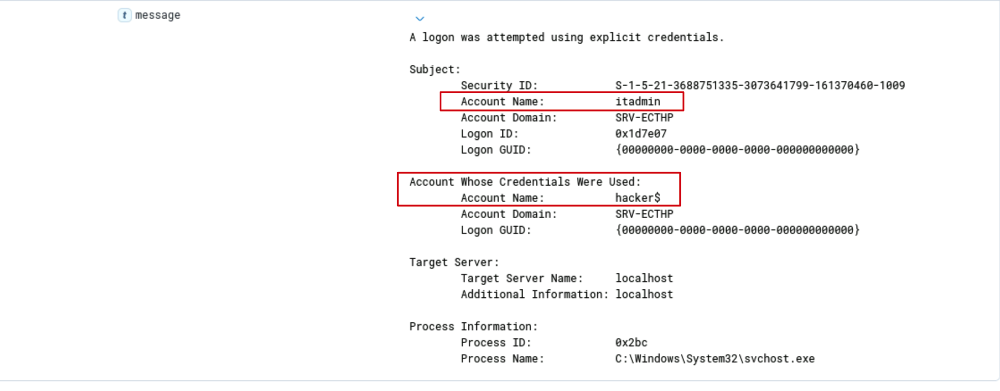

This indicates that the `itadmin` account attempted to log on locally using the credentials of the `hacker$` machine account. A machine account name is usually followed by a `$` sign.

Let's see if we can find other events where this machine account is involved.

**Query:**

```
message: "*hacker$*"
```

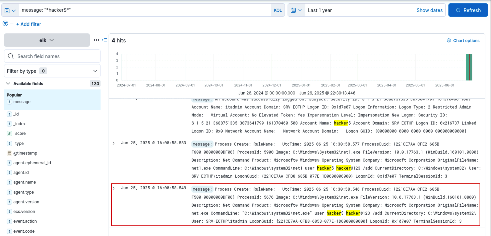

Check the earliest event.

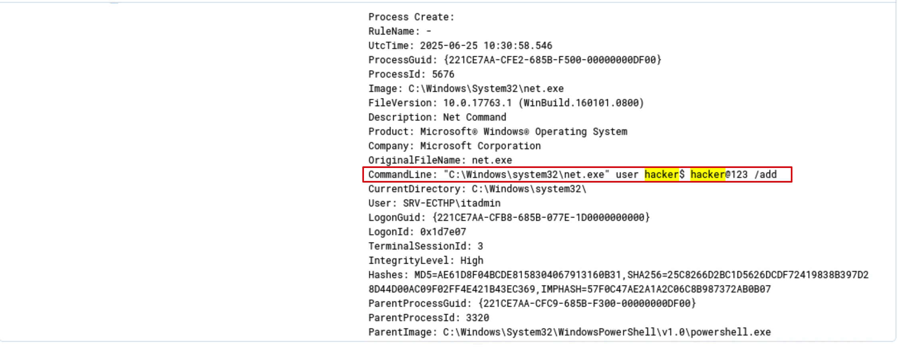

**Key Observations:**

- This is a Sysmon Event ID 1 — Process Creation. This event shows that the `itadmin` account executed a PowerShell command that launched `net.exe` to create a new user account named `hacker$` with the password `hacker@123`.
    
- Username ends in `$` – unusual for user accounts. In Active Directory, names ending with `$` typically refer to machine accounts.
    
- Creating a user account named `hacker$`:
    
    - Looks like an attempt to blend in with legitimate system accounts.
        
    - May be a trick to avoid detection by admins or security tools filtering out user-only accounts.
        
    - Suggests intent to deceive and hide the account in plain sight.
        

Next, review the second event from the top.

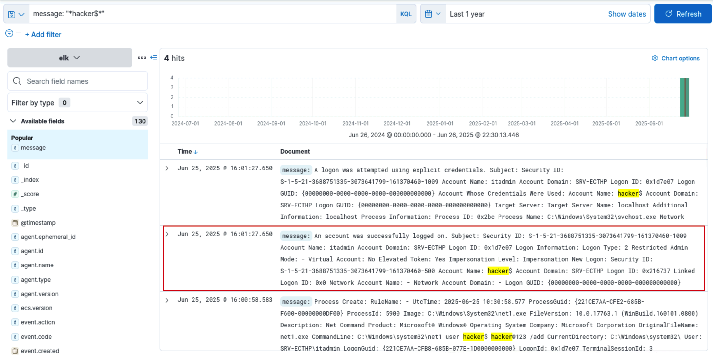

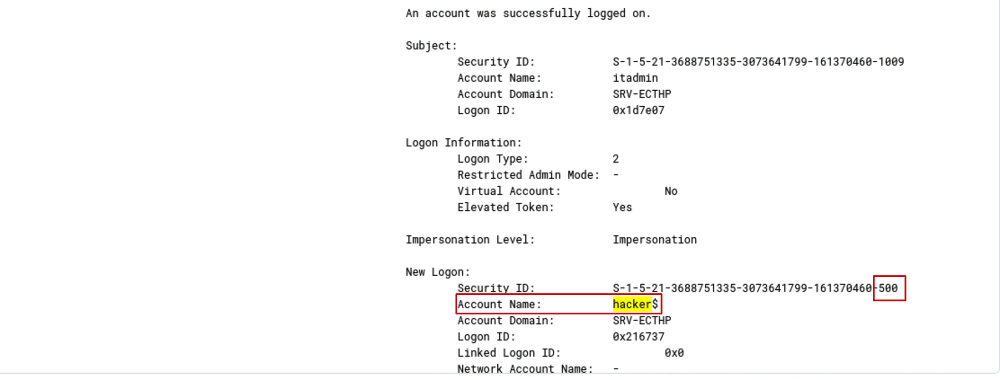

**Key Observations:**

- This event shows that the account `hacker$` successfully logged in locally. The logon was initiated by `itadmin` using explicit credentials.
    
- Note the SID of the `hacker$` account: S-1-5-21-3688751335-3073641799-161370460-500. The SID ending in `500` assigned to `hacker$` is highly suspicious. In Windows, the RID (Relative Identifier) 500 is reserved exclusively for the built-in **Administrator** account. What we have encountered is a classic case of **RID Hijacking**.
    

**What is RID Hijacking?**

RID Hijacking (Relative Identifier Hijacking) is a post-exploitation technique where an attacker:

1. Creates a new user account (e.g., hacker$)
    
2. Modifies the account’s RID in the Windows registry to match that of a high-privileged account — usually the built-in Administrator account (RID 500)
    
3. The result:
    
4. The attacker-controlled user inherits all privileges of the Administrator.
    
5. But the name, creation time, and activity trail show a non-privileged-looking account.
    

So, RID Hijacking was likely performed in this system. The attacker created a new account named `hacker$` and altered its RID to `500`, which is normally reserved for the built-in Administrator account. This allowed the attacker to gain full administrative privileges while hiding under a non-default account name, evading detection by conventional monitoring tools.

**Step 5:** To check the DLLs loaded by a process, we need to refer to **Sysmon Event ID 7**.

**Query:**

```
winlog.channel:"Microsoft-Windows-Sysmon/Operational"
AND winlog.event_id:7
AND message:*SignatureStatus*
AND NOT message:"SignatureStatus: Valid"
```

**Explantion:**

`winlog.event_id:7`

- Retrieves Sysmon Event ID 7 – Image Loaded.
    
- Triggered when a process loads a DLL or executable into its address space.
    

`message:*SignatureStatus*`

- Ensures the log contains a code signature check result.

`NOT message:"SignatureStatus: Valid"`

- Filters out binaries or DLLs with valid digital signatures.
    
- Returns only binaries or DLLs with invalid, missing, expired tampered signatures.
    

This query identifies processes that load unsigned or suspiciously signed binaries/DLLs. By filtering Sysmon Event ID 7 logs where `SignatureStatus` is not "Valid", it helps detect the use of potentially malicious or tampered DLLs/binaries.

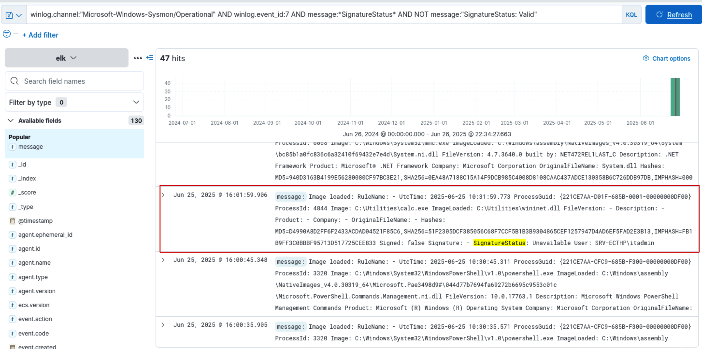

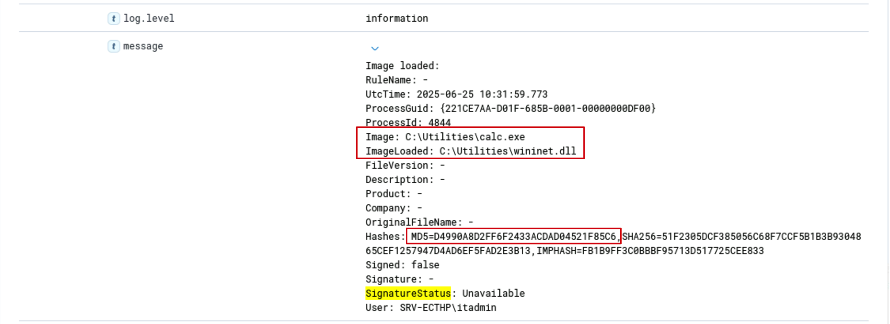

We notice a suspicious event with the timestamp - Jun 25, 2025 16:01:59.906.

This event recorded a process (in this case, `calc.exe`) loading a DLL into memory — here, `wininet.dll`.

**Why This Is Suspicious?**

1. **DLL Sideloading Technique**
    
2. `wininet.dll` is a legitimate Windows DLL usually found in `C:\Windows\System32\`.
    
3. But here, it’s located in `C:\Utilities\` — a non-standard path, suggesting it may be a malicious copy or modified version.
    
4. **Unsigned DLL**
    
5. `Signed: false` and `SignatureStatus: Unavailable` → Windows couldn't verify the DLL's signature.
    

**What is DLL Sideloading?**

DLL Sideloading is a stealthy attack technique where an attacker places a malicious DLL in the same directory as a legitimate signed executable, so that the executable unknowingly loads the attacker's DLL.

To determine if the DLL is actually malicious, copy the MD5 hash of the DLL from the Sysmon event and check it on VirusTotal.

**MD5 Hash:** D4990A8D2FF6F2433ACDAD04521F85C6

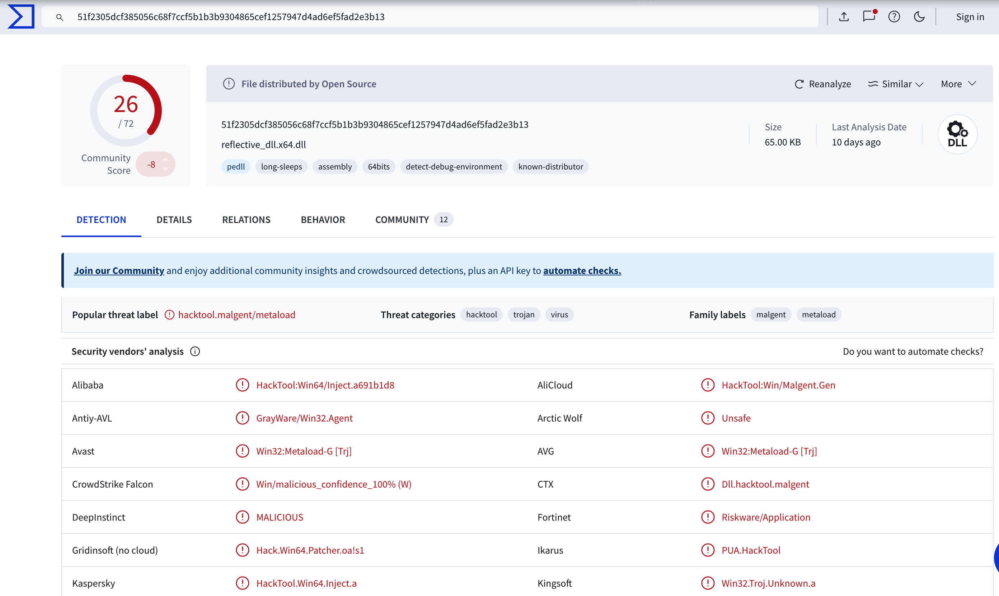

Various security vendors have flagged this DLL as malicious!

**Step 6:** Next, critical settings that can significantly impact security include domain policy configurations and firewall settings.

**Query:**

```
winlog.channel:"Security" AND (winlog.event_id:4739 OR winlog.event_id:4950)
```

This query is designed to filter Windows Security logs to show only events with:

- **Event ID 4739** – A domain policy was modified
    
- **Event ID 4950** – A Windows Firewall setting has changed (Windows Filtering Platform)
    

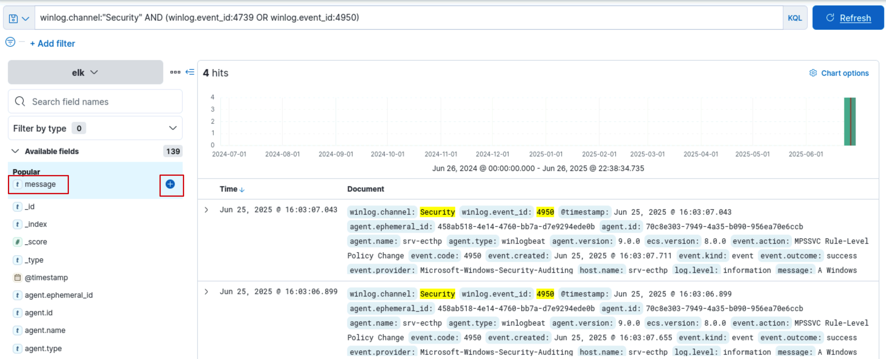

We can see some events. To see only the `message` field in the events, add the `message` field as a column.

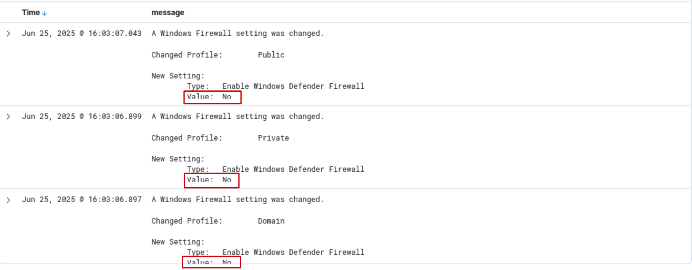

Notice that the firewall was disabled for all profiles — Private, Public, and Domain.

Additionally, a domain policy was changed. Expand it to see more details.

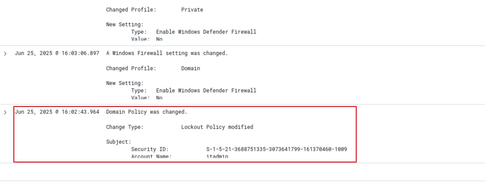

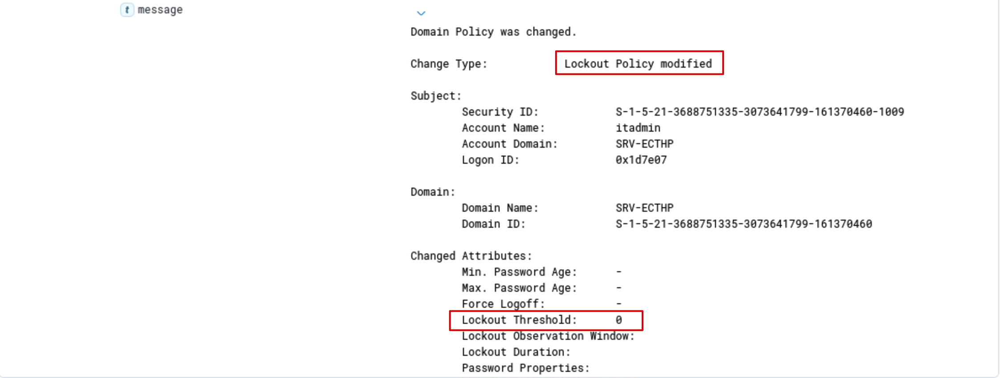

Specifically, the **Lockout Policy** was modified. The **Lockout Threshold** was changed to 0, meaning account lockouts are now disabled.

The attacker disabled the Windows firewall across all profiles and modified domain lockout policies to allow unlimited login attempts. These changes significantly reduce the system’s defensive posture, facilitating stealthy brute-force attacks, lateral movement, and long-term persistence. This activity strongly indicates post-compromise behavior aimed at evading detection and maintaining control over the environment.

# Conclusion

This lab uncovered a sequence of post-exploitation activities that demonstrate how attackers can establish persistence, evade detection, and weaken an enterprise’s defensive posture once inside a compromised environment.

Key attacks observed included:

**Userinit Key Tampering** — modifying the registry to execute a backdoor during user logon.

**RID Hijacking** — impersonating privileged accounts by manipulating security identifiers.

**DLL Sideloading** — using a trusted executable to load a malicious DLL from a non-standard path.

**Domain Policy Tampering** — disabling account lockouts to facilitate brute-force attacks.

**Firewall Disabling** — removing host-level protections to allow unrestricted remote access.

These techniques reflect advanced adversary behavior aimed at persistence, privilege escalation, and stealth.

# References

- https://www.ultimatewindowssecurity.com/securitylog/encyclopedia/
- https://www.virustotal.com/gui/home/search