# Lab Environment

In this lab environment, you will have GUI access to a Kali machine. The ELK instance should be accessible at `http://elk.basic.local:5601`. Use the `elk` index for all queries.

**Objective:** Perform threat hunting in ELK to complete the following tasks:

1. Identify the creation of a suspicious executable file disguised as a document (e.g., `.pdf.exe`) and determine the location where it was dropped.
2. Retrieve hash values (MD5, SHA256) of the suspicious file from Sysmon logs and assess their presence using threat intelligence platforms like VirusTotal.
3. Determine when and how the disguised file was executed.
4. Investigate if any scheduled tasks were used to maintain persistence.
5. Extract evidence of `schtasks.exe` execution and identify the name and schedule of the task created.

**Note:** The incident took place in June 2025.

# Tools

The best tools for this lab are:

- ELK Stack
- Firefox
**Step 1:** Access the Kali machine.


**Step 2:** Navigate to the following URL to access Elasticsearch:

**URL:**

```
http://elk.basic.local:5601
```


Navigate to the **Discover** tab, select the proper index (i.e., **elk**), and set the date range to cover the incident period (June 2025).

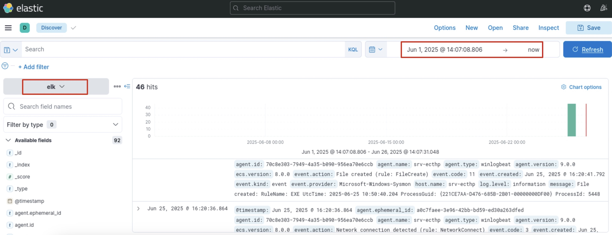

**Step 3:** Identify a suspicious executable disguised as a document.

Let’s kick off our threat hunt by searching for potentially malicious executable files that are masquerading as legitimate documents. These types of files often use deceptive names, such as ending with `.pdf.exe`, to trick users into executing them.

**Query:**

```
event.code:11 AND "*pdf.exe"
```

**Explanation:**

- `event.code:11`: filters for events where a file was created (Sysmon Event ID 11 corresponds to file creation).
    
- `"*pdf.exe"`: looks for file names that end with .pdf.exe, a common tactic used by attackers to disguise executables as harmless PDF files.
    

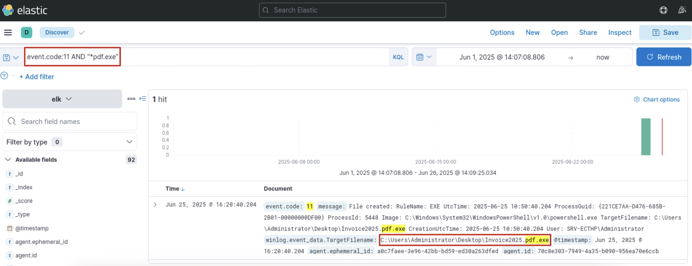

We identified the suspicious file named `Invoice2025.pdf.exe` located at `C:\Users\Administrator\Desktop\Invoice2025.pdf.exe`.

**Step 4:** Now that we've identified the suspicious file, the next step is to extract its hash value. This allows us to verify its reputation by checking it against known malware databases like VirusTotal.

**Query:**

```
"Invoice2025.pdf.exe" AND "Hashes"
```

**Explanation**:

- This query searches for log entries that mention the filename "Invoice2025.pdf.exe" and include the term "Hashes".
    
- The presence of "Hashes" ensures we're retrieving logs that contain the cryptographic hash (e.g., SHA256) of the file, which is essential for verifying the file's integrity or known malicious status.
    

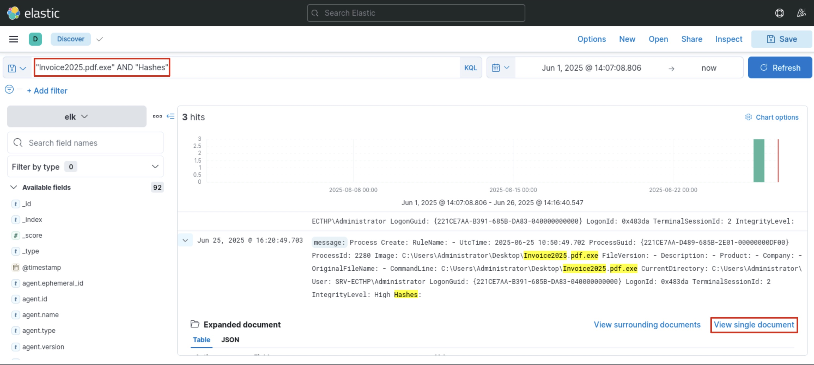

Click on "View single document".

Here, scroll down and search for hashes.

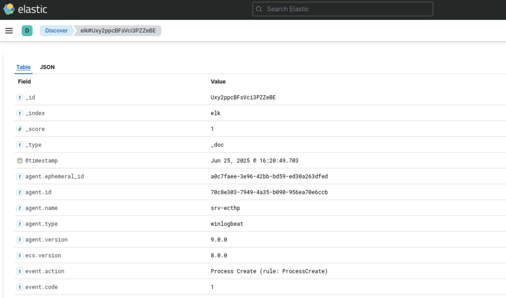

We found the hash values of the suspicious file. Copy the MD5 hash: **B8EA2C6636081C26E8691326D19A3C40**

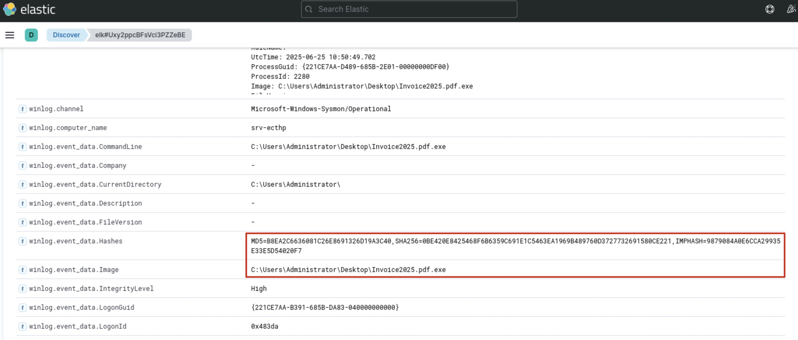

**Note:** Since the lab environment does not have internet access, you'll need to visit VirusTotal from your local machine to check the file hash.

**VirusTotal URL**: [https://www.virustotal.com/gui/file/0be420e8425468f6b6359c691e1c5463ea1969b489760d3727732691580ce221]

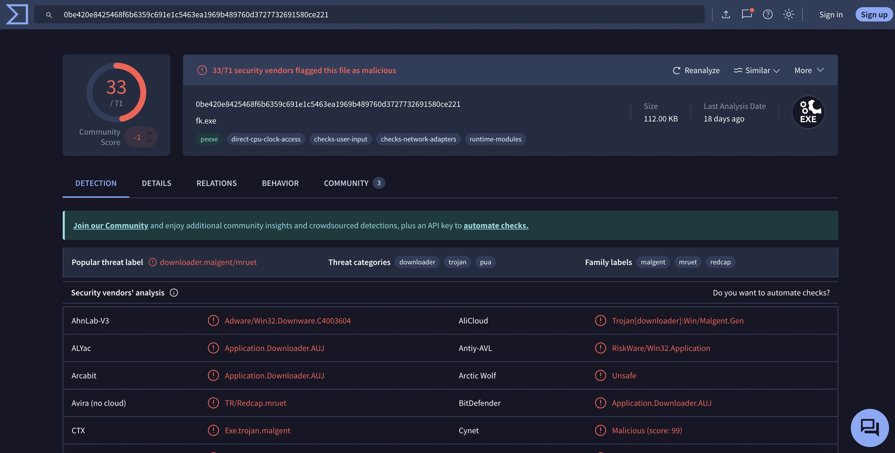

The file is flagged as malicious on VirusTotal and is actually `fk.exe` masquerading as `Invoice2025.pdf.exe`.

**Step 5:** Determine when and how the disguised file was executed.

Now that we’ve confirmed the file is malicious, the next step is to identify when and how it was executed on the system. This helps us understand the attack timeline and assess potential impact.

**Query:**

```
event.code:1 AND "Invoice2025.pdf.exe"
```

**Explanation:**

- `event.code:1`: filters for process creation events (Sysmon Event ID 1), which are generated whenever a new process is started.
    
- `"Invoice2025.pdf.exe"`: ensures that we are only looking at process creation logs related to the suspicious file we previously identified.
    

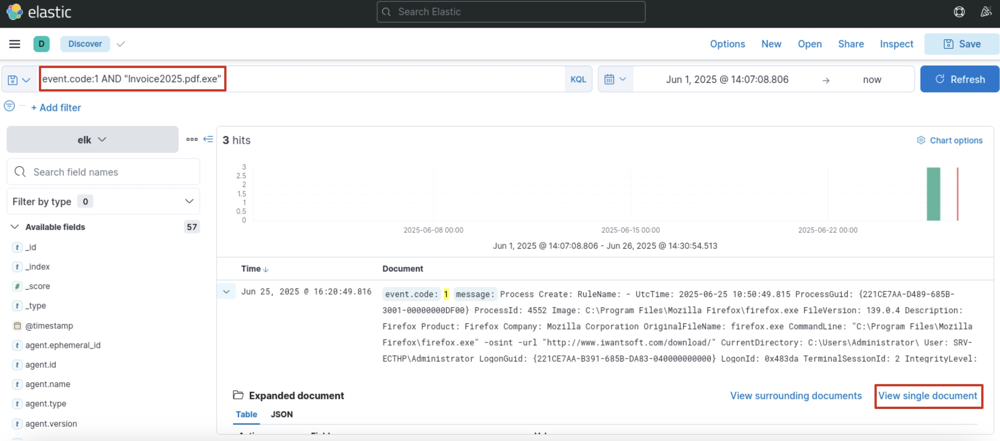

Click on "View single document".

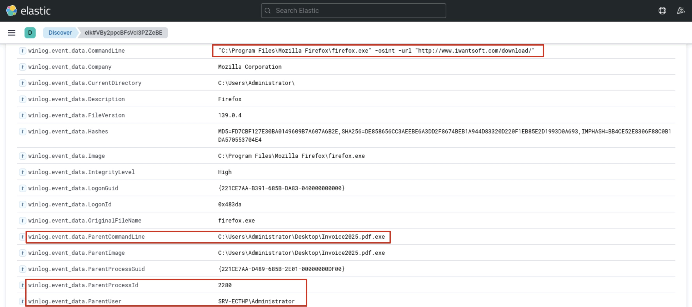

The logs indicate that the user launched a file masquerading as a PDF `Invoice2025.pdf.exe`. That executable then spawned a Firefox process to access `http://www.iwantsoft.com/download/` using the -osint flag (typically invoked when opening external links from another application).

We can also observe that the parent process ID is `2280`. Let’s scroll through the logs and look for an entry with the same process ID to better understand what initiated this activity.

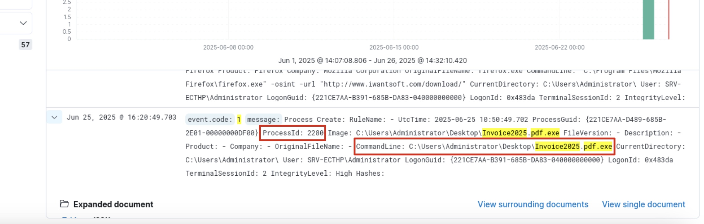

**From the log:**

- `Event Code: 1`: This corresponds to a process creation event (Sysmon).
    
- `Image: C:\Users\Administrator\Desktop\Invoice2025.pdf.exe`: This is the executable that was run, disguised as a PDF file.
    
- `CommandLine`: Also shows the same path, further confirming manual execution.
    
- `ProcessId: 2280` — This uniquely identifies the running instance of the process.
    

This log clearly shows that the user executed the file `Invoice2025.pdf.exe`.

**Step 6:** Investigate if any scheduled tasks were used to maintain persistence.

In this step, we’ll check whether the attacker attempted to maintain persistence by creating scheduled tasks. Scheduled tasks are commonly used by adversaries to ensure their malicious code runs repeatedly or survives system reboots.

**Query:**

```
event.code:4688 AND "schtasks.exe"
```

**Explanation**:

- `event.code:4688`: refers to a Windows Security event ID that logs whenever a new process is created. This is useful for tracking command-line activity on the system.
    
- `"schtasks.exe"`: filters for instances where the Windows Task Scheduler utility was used — a strong indicator of possible persistence mechanisms.
    

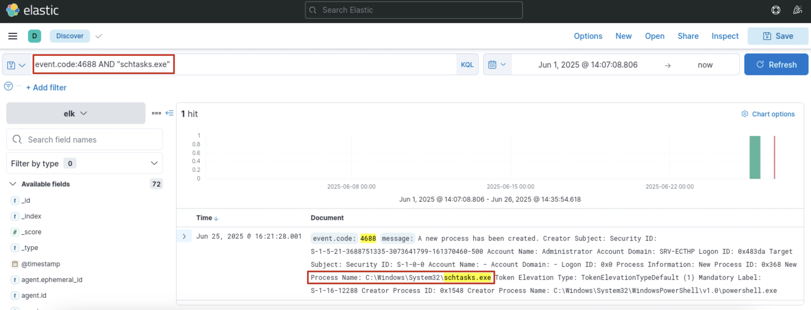

Now that we've identified potential use of schtasks.exe, the next step is to extract concrete evidence of scheduled task creation and examine its details, such as the task name and schedule.

**Query:**

```
event.code:4698
```

**Explanation**:

- `event.code:4698`: corresponds to the Windows Security Event ID for "A scheduled task was created."

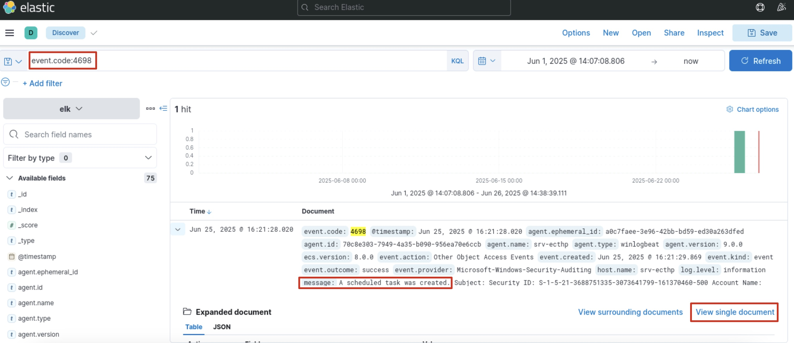

This confirms that a malicious scheduled task was created. Click on "View single document".

- Task Name: **\Flag_5160edb3606376bcf9aac4ef3a78f0d0**
    
- The task is set to repeat every hour `(<Interval>PT1H</Interval>)`.
    

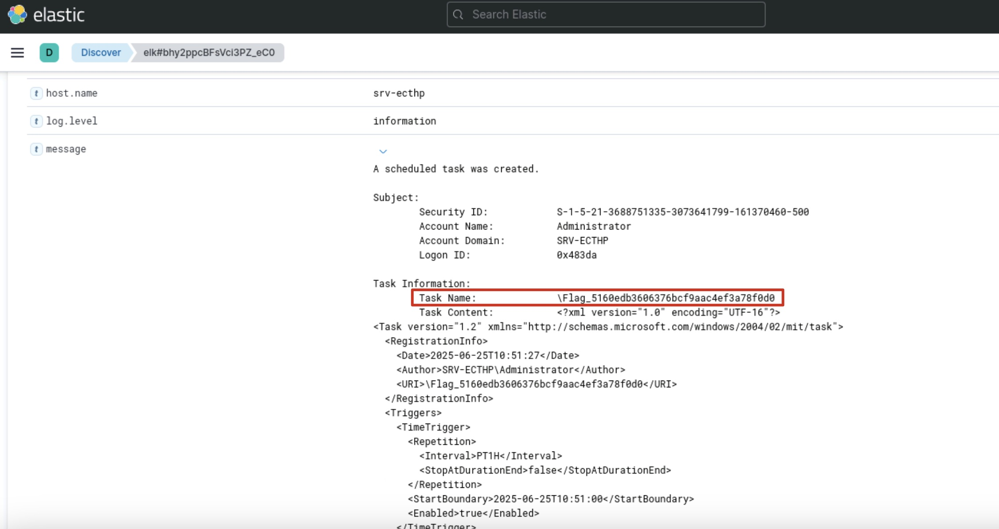

- Command Executed by the Task: `C:\Users\Administrator\AppData\Roaming\goodupdater.exe`
    
- This path points to an executable named `goodupdater.exe`, stored in the `AppData\Roaming` directory a known location abused by malware for persistence.
    

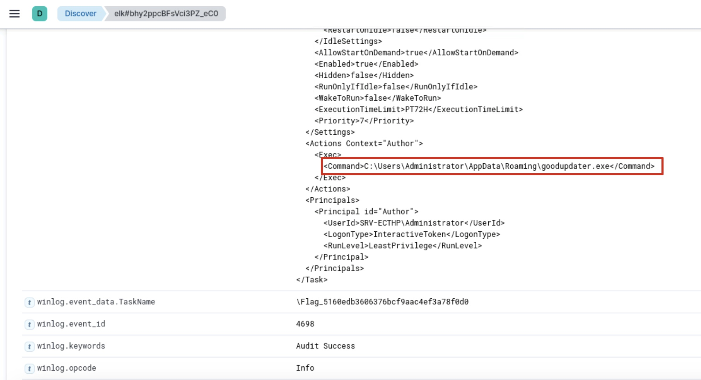

Flag: **5160edb3606376bcf9aac4ef3a78f0d0**

End of the Lab!

# Conclusion

In this lab, we explored how to perform threat hunting using the ELK Stack by analyzing Windows Security and Sysmon logs. Through a series of hands-on queries, we identified malicious activity, traced process execution, examined file creation events, and uncovered persistence mechanisms such as scheduled tasks. This exercise provided foundational experience in detecting and investigating threats across various stages of an attack lifecycle using ELK.

# References

- https://www.ultimatewindowssecurity.com/securitylog/encyclopedia/